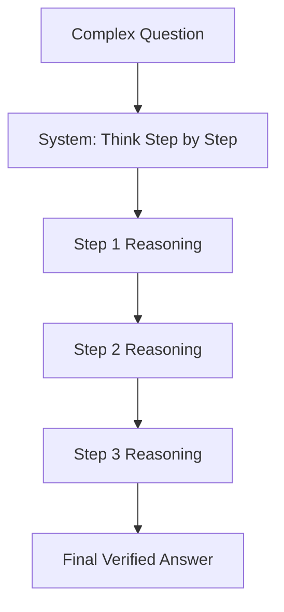
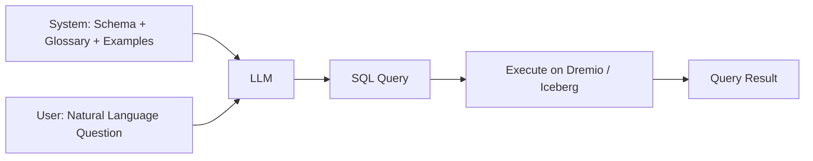

# Prompt Engineering

## Core Definition

Prompt Engineering is the discipline of designing, structuring, and optimizing the text inputs (prompts) provided to a Large Language Model to elicit accurate, relevant, and consistently high-quality outputs. As LLMs become the reasoning engines for enterprise analytics, AI agents, and automated data pipelines, prompt engineering has emerged as a critical engineering discipline distinct from traditional software development — one that requires understanding how language models process context, represent knowledge, and generate text.

The term may suggest a superficial or temporary practice that will be eliminated as models improve. In practice, prompt engineering has grown more sophisticated alongside model capability. Better models respond more reliably to good prompts and are more sensitive to poor prompt design. The discipline continues to evolve because the boundary between "model capability" and "prompt design" is not fixed — what requires careful prompting today becomes automatic with tomorrow's model, while tomorrow's model opens new capabilities that require new prompt patterns.

## Foundational Techniques

**Zero-Shot Prompting:** Providing only the task instruction without any examples. The simplest form of prompt engineering. "Summarize the following text in three bullet points:" followed by the text. Works well for straightforward tasks that the model has seen many examples of during pre-training. Fails for specialized tasks where the expected output format or reasoning approach is non-obvious.

**Few-Shot Prompting:** Providing 3-8 demonstrations of the desired input-output format before the actual task. The model uses these examples to infer the expected behavior without explicit instruction. Few-shot prompting is particularly powerful for format standardization, domain-specific terminology, and tasks with non-obvious output structures. Selection of high-quality, diverse, representative examples is critical — a single misleading example can dramatically degrade model performance.

**Instruction Tuning Format (System/User/Assistant):** Modern chat-optimized LLMs expect prompts structured with a System message (defining the model's persona, constraints, and high-level instructions), a User message (the actual user request), and optionally prior Assistant messages (conversation history). The System message is the most powerful lever for shaping overall model behavior: tone, output format, domain expertise, safety constraints, and tool use patterns.

## Chain-of-Thought (CoT) Prompting

Chain-of-Thought prompting, introduced in the 2022 paper "Chain-of-Thought Prompting Elicits Reasoning in Large Language Models" (Google Brain), instructs the model to produce intermediate reasoning steps before delivering a final answer. This dramatically improves performance on multi-step reasoning tasks: arithmetic, logical deduction, commonsense reasoning, and complex analytical questions.

**Zero-Shot CoT:** Adding "Let's think step by step" or "Think through this carefully before answering" to the prompt triggers the model to externalize its reasoning process without requiring manually crafted examples. This simple addition can improve accuracy on reasoning benchmarks by 20-40%.

**Few-Shot CoT:** Providing manually crafted demonstrations where each example shows both the question, the step-by-step reasoning chain, and the final answer. More powerful than zero-shot CoT for domain-specific reasoning tasks where the appropriate reasoning approach is not obvious.

**Why CoT Works:** By externalizing the reasoning process into the output, the model is forced to "commit" to intermediate conclusions that constrain subsequent reasoning steps. This reduces the likelihood of reasoning shortcuts and prevents the model from jumping to a confident but incorrect conclusion that then gets rationalized retroactively.

## Advanced Reasoning Patterns

**Tree of Thoughts (ToT):** Generalizes CoT by generating multiple parallel reasoning branches, evaluating the promise of each branch, and exploring the most promising ones further. For complex problems with many possible solution strategies, ToT outperforms linear CoT by finding better solutions through systematic exploration. Computationally expensive but achieves state-of-the-art results on logic puzzles and complex planning tasks.

**Self-Consistency:** Generates multiple independent Chain-of-Thought reasoning chains for the same problem and takes a majority vote of the final answers. This simple ensemble approach significantly improves reliability on problems where the model occasionally takes a wrong reasoning path. Applicable anywhere token budget allows multiple completions.

**Recursive Self-Improvement (RSI) Prompting:** A three-phase pattern: (1) Generate an initial answer. (2) Ask the model to critique its own answer for specific failure modes (inaccuracy, incompleteness, logical inconsistency). (3) Generate an improved answer based on the critique. Multiple iterations progressively refine output quality without changing the model.

**ReAct (Reasoning + Acting):** The foundational pattern for AI agents. Interleaves reasoning ("I need to find the Q3 revenue for APAC — I should query the financial table") with action (execute SQL query) and observation (read the query result) in a structured loop until the goal is achieved.

## Structured Output Prompting

For programmatic use, LLMs need to produce structured outputs (JSON, XML, YAML) that downstream systems can parse reliably. Structured output prompting uses several techniques:

**JSON Mode:** Many modern LLM APIs (OpenAI, Anthropic) support a JSON output mode that constrains the model to always produce valid JSON. Combined with a schema specification in the prompt ("Respond with a JSON object with fields: analysis (string), confidence (float 0-1), recommended_action (string)"), this produces reliably parseable outputs.

**Function Calling Schema:** AI agent frameworks pass the model a JSON schema describing available tools. The model generates tool calls as structured JSON objects specifying tool name and arguments, which the framework validates and executes.

**Pydantic/TypedDict Constraints:** Python-based agent frameworks (LangChain, LlamaIndex) use Pydantic models to enforce output structure, automatically retrying with an error message if the model's output fails validation.

## Prompt Engineering for Text-to-SQL

Text-to-SQL is one of the most economically important applications of prompt engineering in the open data lakehouse ecosystem. An LLM equipped with a well-designed prompt can translate natural language business questions into accurate SQL queries that execute against Iceberg tables via Dremio, Trino, or Spark SQL.

Key elements of an effective Text-to-SQL prompt:
1. **Schema context:** The exact DDL (CREATE TABLE statements with column names, data types, and descriptions) for all tables the model might query.
2. **Business glossary:** Definitions of business terms mapped to specific tables and columns ("Revenue = SUM(fact_sales.net_amount)").
3. **Example queries:** 5-10 high-quality NL/SQL pairs demonstrating the expected query patterns, JOIN relationships, and metric calculations.
4. **Dialect specification:** Explicit instruction on the SQL dialect in use (DuckDB SQL, Spark SQL, Trino SQL differ in date handling, array functions, and window functions).
5. **Output constraints:** Instructions to produce only a single SQL SELECT statement with no markdown formatting, as certain execution environments cannot handle markdown-wrapped code.

## Enterprise Prompt Management

Production LLM applications require systematic prompt management:

**Version Control:** Prompts are stored in version control (Git) alongside the application code. Changes to prompts go through pull requests and code review.

**Evaluation Suites:** Automated test suites run the current prompt against a labeled dataset of example inputs with known correct outputs, measuring accuracy, format compliance, and safety.

**Prompt Registries:** Enterprise platforms (LangSmith, Langfuse, W&B Prompts) store versioned prompts, track usage, and log model inputs/outputs for debugging and compliance.

**A/B Testing:** Competing prompt variants are deployed to different traffic splits and evaluated on production metrics to identify improvements before full deployment.

## Visual Architecture

### Diagram 1: Chain-of-Thought Prompting

### Diagram 2: Text-to-SQL Prompt Structure

