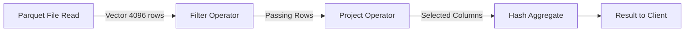
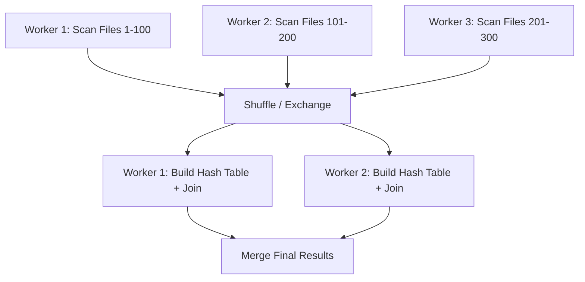

# Query Execution

## Core Definition

Query Execution is the runtime phase in which a database or query engine carries out the physical execution plan produced by the query planner, reading data from storage, performing computations (filters, joins, aggregations), exchanging intermediate results across network boundaries in distributed systems, and delivering the final result set to the client.

While Query Planning determines *what* to do, Query Execution determines *how* it is done at the lowest mechanical level — which CPU instructions process each batch of rows, how memory is allocated for hash tables, how data is serialized and transmitted between nodes in a distributed cluster. The efficiency of query execution ultimately determines whether an analytical query returns in 100 milliseconds or 10 minutes.

## The Pipeline Model

Modern query engines use a **pipeline (push-based) execution model** where data flows through a chain of operators. Each operator reads batches of rows from its input, transforms them, and pushes results to the next operator without materializing the entire intermediate result set in memory.

The pipeline model is contrasted with the older **materialization model** where each operator completely computed and materialized its output before passing it to the next operator. Materialization requires much more memory (entire intermediate result sets must be held in RAM) and produces much higher latency for streaming outputs.

In a pipeline, filters are applied immediately as rows are read from storage, reducing the number of rows flowing through the pipeline early. Projections (selecting only required columns) reduce the width of each row. The pipeline terminates when the query limit is reached or all input is consumed.

## Vectorized Execution

Traditional query engines processed data one row at a time through the operator pipeline, making a function call for each row at each operator. This "Volcano model" (Graefe 1994) produces enormous function call overhead for high-throughput analytical queries scanning billions of rows.

**Vectorized execution**, pioneered by MonetDB and popularized by DuckDB, Velox, and Apache Arrow Compute, processes data in batches of 1,024 to 8,192 rows (called vectors or batches) at each operator, rather than one row at a time. This provides two critical benefits:

**CPU Efficiency:** Processing a vector of values with a single function call amortizes the function call overhead across thousands of rows. The tight inner loop operating on a dense array of values also enables the CPU's SIMD (Single Instruction, Multiple Data) instruction sets (AVX-512, NEON) to process multiple values per clock cycle in parallel.

**Cache Efficiency:** A vector of 4,096 int64 values occupies 32KB — fitting entirely within the CPU's L1 or L2 cache. Processing the entire vector without cache misses is dramatically faster than the random memory access pattern of row-at-a-time processing.

The shift from row-at-a-time to vectorized batch processing typically produces 5-20x throughput improvements for CPU-bound analytical queries.

## Distributed Execution

In a distributed query engine (Dremio, Trino, Apache Spark), the physical execution plan is partitioned into stages that execute in parallel across a cluster of worker nodes.

**Scan Stage:** Each worker scans a disjoint subset of the input data files. For an Iceberg table with 10,000 Parquet files, a 100-worker cluster might assign 100 files per worker. Workers scan their assigned files in parallel, applying filters and projections locally.

**Exchange (Shuffle):** When a query requires joining two tables or performing a global aggregation, data from all workers must be redistributed so that rows that need to be processed together (matching join keys, same groupby key) end up on the same worker. This network shuffle — serializing data, sending it over the network, deserializing on the receiving side — is often the dominant cost in distributed query execution.

**Build and Probe (Hash Join):** The smaller join input ("build side") is scanned first and used to build a hash table in each worker's memory. The larger input ("probe side") is then scanned, and each row's join key is looked up in the hash table. Matching rows are joined and passed to the next pipeline stage.

**Aggregation:** Distributed aggregation is typically performed in two phases: partial aggregation at each worker (computing local group sums/counts), followed by a shuffle that routes each group key to a single worker, followed by final aggregation of the partial results.

## Memory Management

Distributed query execution is extremely memory-intensive. Hash tables for large joins can require hundreds of gigabytes of RAM. Aggregations over high-cardinality group keys can require memory proportional to the number of distinct groups.

Query engines implement memory management systems that track memory consumption per query and per operator. When memory pressure exceeds configured thresholds, operators spill intermediate state to disk — writing hash tables or sort buffers to local SSD storage and reading them back as needed. Spilling to disk preserves correctness at the cost of dramatically increased query latency.

## Apache Velox: The Unified Execution Engine

Apache Velox (open-sourced by Meta in 2022) is a reusable, embeddable C++ vectorized query execution library designed to serve as the shared execution layer for multiple query engines. By implementing a single high-performance vectorized engine once and embedding it in multiple query systems (Presto, Spark, and others), Velox eliminates redundant reimplementation of the same low-level computational primitives across the industry.

Velox provides: vectorized operators (hash join, sort, hash aggregation, window functions), built-in support for Apache Arrow format for zero-copy data exchange, native connector APIs for reading Parquet and ORC files, and expression evaluation with compiled code generation for maximum CPU efficiency.

## Visual Architecture

### Diagram 1: Vectorized Pipeline Execution

### Diagram 2: Distributed Execution Stages

