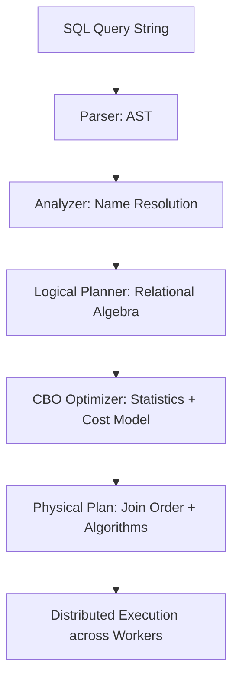
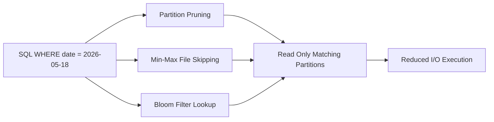

# Query Planning

## Core Definition

Query Planning is the process by which a database or query engine transforms a declarative SQL query into a detailed, optimized execution plan: a concrete sequence of physical operations (scans, joins, aggregations, sorts, exchanges) that will be executed by the query engine's workers to produce the correct result as efficiently as possible.

The query planner is one of the most complex and consequential components of any SQL engine. A well-designed planner can produce an execution plan that runs a query in seconds; a poorly designed one (or one given insufficient statistics to work with) can produce a plan that runs the same logically equivalent query in hours.

Understanding query planning is essential for data engineers who need to optimize slow queries, interpret query explain plans, and design physical data layouts (partitioning, sorting, statistics) that help the planner make good choices.

## The Planning Pipeline

**Step 1, Parsing:** The SQL string is tokenized and parsed into an Abstract Syntax Tree (AST), a hierarchical data structure that represents the logical structure of the query. Syntax errors are caught at this stage.

**Step 2, Analysis / Name Resolution:** Table and column names in the AST are resolved against the catalog (Apache Polaris, Hive Metastore) to verify their existence, retrieve their data types, and enforce access control. Type compatibility checks are performed (e.g., comparing a string column to an integer constant raises a type error here).

**Step 3, Logical Planning:** The analyzed AST is transformed into a Logical Plan, a tree of relational algebra operators (Project, Filter, Join, Aggregate, Sort, Limit) that represents what needs to be computed, without specifying how. Logically equivalent transformations are applied: predicate pushdown (move filter predicates as close to the data source as possible), constant folding (evaluate constant expressions at planning time), and subquery unnesting (convert correlated subqueries to joins).

**Step 4, Physical Planning / Optimization:** The Logical Plan is converted to a Physical Plan by selecting concrete implementations for each logical operator. This is where the optimizer makes critical decisions:
- Which join algorithm to use (broadcast join, hash join, sort-merge join)?
- In what order to join multiple tables?
- Should aggregations be partially pre-computed at the data source before shuffling across the network?
- Which partitions of which Iceberg tables can be skipped based on partition pruning?
- Can a materialized view or Reflection (in Dremio) substitute for a portion of the query?

**Step 5, Execution Plan Distribution:** In a distributed query engine (Dremio, Trino, Spark), the Physical Plan is divided into pipeline stages and distributed across the cluster's worker nodes for parallel execution.

## Cost-Based Optimization

The heart of modern query optimization is cost-based optimization (CBO). The optimizer maintains statistical models of the data (table row counts, column cardinality, value distributions) and uses these statistics to estimate the cost (in terms of I/O, CPU, network, and memory) of alternative execution plans for the same query.

**Table Statistics:** Row count, byte size, and null counts for each table. Collected by running `ANALYZE TABLE` or automatically maintained by the engine.

**Column Statistics:** Min/max values, distinct value counts (cardinality), and histogram distributions for each column. Used to estimate filter selectivity ("how many rows survive the WHERE clause?") and join cardinality ("how many rows does this join produce?").

**Join Order Optimization:** Given a query joining N tables, there are N! possible join orders. The optimizer uses dynamic programming (System-R algorithm) or genetic algorithms to search for the lowest-cost join order without evaluating all possibilities. With accurate column statistics, the optimizer can select join orders that minimize intermediate result set sizes, dramatically reducing memory pressure and network shuffle volume.

## Iceberg Statistics and the Planner

Apache Iceberg's table format provides rich physical statistics that query planners can use to dramatically reduce data read volume:

**Partition Pruning:** Iceberg manifests record which partition values are present in each data file. A filter `WHERE date = '2026-05-18'` can be resolved to a specific set of files without scanning any files. The planner eliminates entire file groups based on partition predicates before execution begins.

**Column-Level Min/Max Statistics:** Each data file's metadata records the minimum and maximum value of each column. A filter `WHERE revenue > 1000000` can skip entire files where `max(revenue) < 1000000`. This file skipping happens during query planning, before any network I/O.

**Bloom Filter Indexes:** Optional bloom filter indexes stored in Puffin files allow the planner to skip files that provably do not contain a specific value for high-cardinality equality predicates (`WHERE order_id = 'ABC-12345'`).

## EXPLAIN Plans

The primary tool for understanding and debugging query execution is the EXPLAIN output: a text or visual representation of the physical execution plan the engine chose.

Reading an EXPLAIN plan for a Dremio or Trino query reveals:
- Which tables and partitions were scanned
- How many files were read vs. skipped
- Which join algorithm was chosen and the estimated row counts at each stage
- Where data was shuffled across the network
- Where partial aggregations were pushed down to data sources

High estimated row counts at filter stages relative to final output indicate opportunities for better partitioning or statistics. Unexpected full table scans on partitioned tables indicate missing partition statistics or imprecise predicate pushdown.

## Visual Architecture

### Diagram 1: Query Planning Pipeline

### Diagram 2: Iceberg Statistics in Planning

