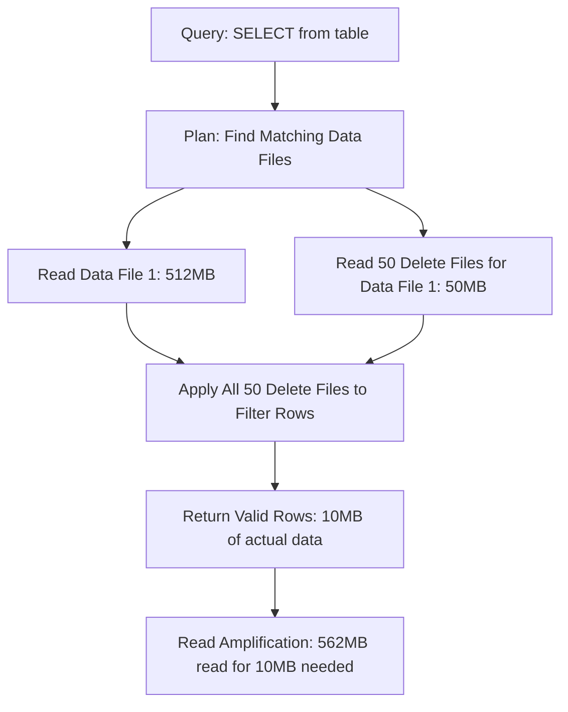
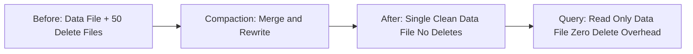

# Read Amplification

## Core Definition

Read Amplification is the phenomenon where a query must read more data from storage than is logically required to satisfy the query's result, due to the overhead of reading auxiliary metadata, delete files, or duplicate copies of updated records. In the open data lakehouse context, read amplification most commonly occurs with Merge-on-Read (MoR) write semantics in Apache Iceberg and Apache Hudi, where delete files and position markers accumulate alongside data files and must be applied during query execution.

Read amplification is the complement of write amplification: strategies that minimize write overhead (MoR, lightweight deletes) tend to increase read overhead, while strategies that minimize read overhead (Copy-on-Write, eager compaction) increase write overhead. Managing this tradeoff is a core concern in lakehouse performance optimization.

## Sources of Read Amplification in Iceberg

**Delete File Application (Position Deletes):** In Merge-on-Read mode, when rows are deleted, Iceberg writes a position delete file that records the file path and row position of each deleted row. At query time, the reader must:
1. Read the data file.
2. Read the associated position delete file.
3. Apply the delete positions to filter out deleted rows from the data file's output.

If a data file has had many small delete batches applied to it over time, there may be hundreds of delete files that all must be read and applied before a single valid row can be returned. Reading 50 delete files per data file is a 50x read amplification of the delete metadata.

**Equality Delete Scans:** Equality delete files record deleted rows by their key column values rather than by file position. Applying an equality delete requires scanning the data file and comparing each row's key values against all equality delete files that might overlap with the data file's partition. For high-cardinality equality deletes accumulated over time, this comparison work grows proportionally with the number of accumulated delete files.

**Manifest Metadata Reads:** Iceberg's query planning requires reading the manifest list and all matching manifest files before any data files are accessed. For tables with many small snapshots (from frequent streaming writes), the manifest structure can become deeply nested, requiring reads of many manifest files to enumerate the current set of data files.

**Bloom Filter and Statistics Reads:** Puffin files containing bloom filter indexes must be read before the corresponding data files to determine whether to skip each file. For tables with many small files and bloom filter indexes on multiple columns, the aggregate size of Puffin metadata reads can exceed the size of the actual data accessed.

## Quantifying Read Amplification

Read amplification in production systems can be measured by comparing:
- Total bytes read from S3 during query execution (including data files, delete files, manifest files, and Puffin files)
- Net bytes of logically required data (estimated from filtered row count × average row size)

An amplification ratio greater than 5-10x warrants investigation. Very high amplification (>100x) almost always indicates accumulated delete files that require compaction.

## The Compaction Solution

The primary solution to read amplification from accumulated delete files is compaction — specifically the `rewrite_data_files` procedure in Iceberg, which merges delete files into data files during rewrite:

```sql
CALL catalog.system.rewrite_data_files(
  table => 'db.my_table',
  strategy => 'binpack',
  options => map(
    'target-file-size-bytes', '536870912',  -- 512MB
    'delete-file-threshold', '10'  -- Rewrite files with 10+ delete files
  )
);
```

After compaction, the resulting data files contain only the non-deleted rows with all deletes fully applied. Subsequent queries read only data files with no delete file overhead — zero read amplification from deleted rows.

Dremio's `OPTIMIZE TABLE` command runs the equivalent compaction automatically, with the option to set a delete file count threshold that triggers rewriting only the files with excessive delete accumulation.

## Monitoring Delete Accumulation

Iceberg provides the `files` system table that exposes per-data-file statistics including the count of associated delete files:

```sql
-- Find data files with many associated delete files
SELECT file_path, content, record_count, pos_delete_file_count, eq_delete_file_count
FROM catalog.db.my_table.files
WHERE pos_delete_file_count > 5 OR eq_delete_file_count > 5
ORDER BY pos_delete_file_count DESC
LIMIT 100;
```

Files appearing in this query with high delete file counts are prime candidates for targeted compaction. Running compaction selectively on the most delete-heavy files (using `WHERE` clauses or file path filters in the rewrite procedure) allows efficient, targeted read amplification reduction without rewriting the entire table.

## Balancing Read and Write Amplification

The optimal balance between read and write amplification depends on the workload's read-to-write ratio:

**Write-heavy workloads (CDC, streaming updates):** Prefer Merge-on-Read to minimize write amplification. Accept higher read amplification. Schedule frequent targeted compaction on hottest partitions.

**Read-heavy workloads (BI dashboards, ML training):** Prefer Copy-on-Write for tables accessed frequently by many concurrent users. The higher write amplification cost is justified by eliminating read-time delete application overhead for the high-volume read workload.

**Mixed workloads:** Use Iceberg's table-level configuration to set the default write mode per table based on each table's read/write ratio. Hot analytical tables use CoW; CDC-targeted staging tables use MoR with aggressive compaction schedules.

## Visual Architecture

### Diagram 1: Read Amplification from Accumulated Deletes



### Diagram 2: Compaction Eliminates Read Amplification


