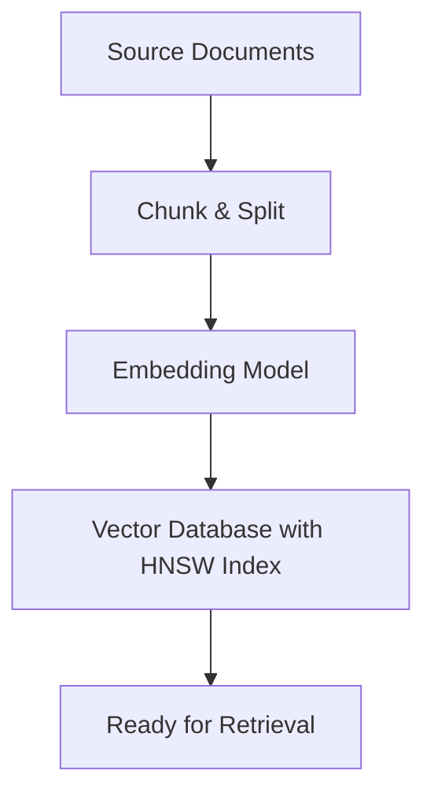
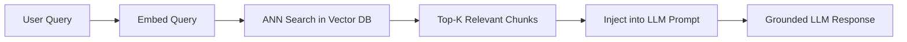

# Retrieval-Augmented Generation (RAG)

## Core Definition

Retrieval-Augmented Generation (RAG) is an AI architecture pattern that enhances a Large Language Model's responses by dynamically retrieving relevant information from an external knowledge base and injecting that information into the model's context window before generating a response.

Without RAG, an LLM relies entirely on knowledge baked into its weights during training. This creates two critical problems for enterprise use: first, the model has a knowledge cutoff date and knows nothing about events afterward; second, when the model does not know an answer with confidence, it tends to generate plausible-sounding but factually incorrect statements: a behavior called hallucination. RAG solves both by grounding the model's reasoning in live, verified, enterprise-specific information at inference time.

Lewis et al. introduced RAG in the 2020 paper "Retrieval-Augmented Generation for Knowledge-Intensive NLP Tasks." The technique was rapidly adopted across the industry and by 2025 has evolved from simple chunk-and-retrieve pipelines to sophisticated agentic retrieval systems.

## The Two-Phase Architecture

**Phase 1, Offline Indexing:**

Documents from all relevant sources (PDF reports, database schema documentation, company policies, analytical playbooks, Slack archives, data catalog entries) are collected and preprocessed. Each document is split into chunks using a chunking strategy that preserves semantic coherence, typically 256 to 1024 tokens per chunk, with a 20% overlap between consecutive chunks to prevent context loss at boundaries.

Each chunk is encoded into a high-dimensional vector embedding (typically 768 to 3072 dimensions) using a transformer-based embedding model. Popular embedding models include OpenAI's text-embedding-3-large, Cohere Embed v3, and open-source alternatives like BGE-M3 and E5-mistral. The embedding model is trained via contrastive learning to place semantically similar texts close together in the vector space and push dissimilar texts apart.

The vectors and their corresponding text payloads are stored in a vector database (Pinecone, Weaviate, Qdrant, Milvus, or pgvector). The vector database builds an ANN index (typically HNSW) that enables sub-millisecond approximate nearest neighbor search at query time.

**Phase 2, Online Retrieval and Generation:**

When a user submits a query, the query is encoded into a vector using the same embedding model. The vector database performs ANN search to find the K most semantically similar chunks (typically K=5 to 20). The retrieved chunks are assembled into a context block and injected into the LLM prompt alongside the original query. The LLM generates a response grounded exclusively in the retrieved facts.

A typical RAG prompt structure: "You are an analytical assistant. Use ONLY the following context to answer the user's question. Do not use prior knowledge. Context: [retrieved chunks]. Question: [user query]. Answer:"

## Chunking Strategies

The granularity and method of chunking significantly impacts retrieval quality.

**Fixed-size chunking** splits documents into equal-length token segments. Simple to implement but can cut sentences mid-thought.

**Semantic chunking** uses the embedding model to detect semantic boundaries: splitting when the cosine similarity between consecutive sentences drops below a threshold. This preserves meaning coherence at the cost of variable chunk sizes.

**Hierarchical chunking** indexes documents at multiple granularities simultaneously: summary-level chunks for broad topic retrieval and sentence-level chunks for precise detail retrieval. The system retrieves at the appropriate level based on query specificity.

**Contextual Retrieval (Anthropic 2024)** prepends each chunk with a short context summary generated by the LLM using the full document as context: "This chunk is from a Q3 2025 APAC revenue report. It discusses the specific impact of currency exchange rates on electronics division performance." This dramatically improves retrieval precision for ambiguous queries.

## Advanced Retrieval Techniques

**Hybrid Search:** Combines dense vector search (semantic similarity via ANN) with sparse keyword search (BM25 or SPLADE). The dense component finds semantically related content; the sparse component ensures exact term matching for product codes, error codes, and proper nouns. Scores from both searches are fused using Reciprocal Rank Fusion (RRF) to produce a unified ranking.

**Query Rewriting:** Before retrieval, a secondary LLM rewrites the user's raw query to be more retrieval-optimized. "What happened to our numbers last quarter?" becomes "Revenue performance summary Q3 2025 North America." This dramatically improves recall for conversational queries.

**HyDE (Hypothetical Document Embedding):** The LLM generates a hypothetical perfect answer to the query. This hypothetical answer is then embedded and used as the search vector. Because the hypothetical answer resembles the vocabulary and style of actual answer documents more closely than the raw question does, retrieval recall improves significantly.

**Re-Ranking:** After the initial ANN retrieval returns top-K results, a cross-encoder re-ranker model (such as Cohere Rerank or a ColBERT-based model) evaluates each retrieved chunk against the query with higher precision, reordering results to surface the most relevant chunks at the top before they are injected into the LLM prompt.

**Multi-Query Retrieval:** The agent decomposes the original complex question into 3-5 subquestions, retrieves results for each independently, deduplicates, and combines them into a unified context. This improves coverage for multi-faceted questions.

## Agentic RAG

By 2025, the dominant paradigm is Agentic RAG, where retrieval is not a fixed linear pipeline but a dynamic decision made by an AI agent during its reasoning loop. The agent decides when retrieval is needed, what query to send to the vector store, whether the retrieved results are sufficient, and whether to issue follow-up retrieval queries to fill gaps.

This approach eliminates the brittle "always retrieve K chunks" pattern and replaces it with adaptive, context-sensitive retrieval that mirrors how a skilled analyst would approach information gathering.

## GraphRAG

Microsoft Research introduced GraphRAG in 2024, augmenting traditional vector retrieval with a knowledge graph layer. GraphRAG extracts entities (people, organizations, products, dates) and relationships from the document corpus and builds an explicit graph. For complex queries that require "multi-hop" reasoning ("Which suppliers of critical components have also had compliance violations in the past two years?"), graph traversal outperforms pure vector similarity search, which has no mechanism for chaining relational reasoning across multiple documents.

## RAG in the Data Lakehouse

In an open data lakehouse environment, RAG plays two distinct roles:

**Structured data retrieval:** For numerical questions ("What was total APAC revenue in Q3 2025?"), the agent uses Text-to-SQL to query Apache Iceberg tables via Dremio or Trino rather than vector search. The answer is mathematically precise.

**Unstructured knowledge retrieval:** For contextual questions ("Why did APAC revenue decline in Q3 2025?"), the agent queries the vector database populated with analyst commentary, board reports, market research, and data catalog documentation. RAG provides qualitative context that SQL cannot.

The catalog itself is a critical RAG source. Storing Iceberg table descriptions, column definitions, lineage metadata, and business glossary entries as vector-indexed documents allows agents to discover and correctly interpret available data assets without human mediation.

## Visual Architecture

### Diagram 1: RAG Indexing Pipeline

### Diagram 2: RAG Retrieval and Generation

