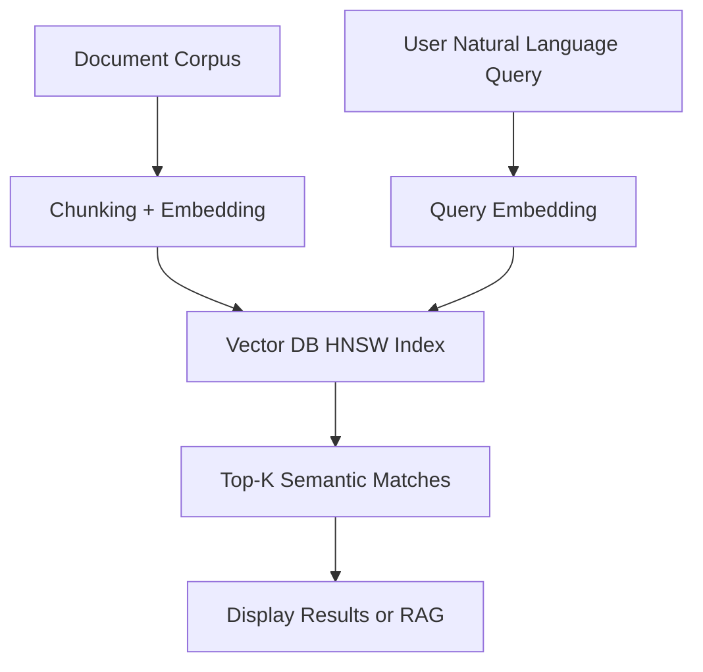
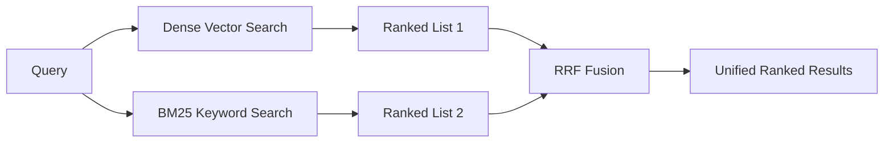

# Semantic Search

## Core Definition

Semantic Search is a search methodology that understands the intent and contextual meaning behind a query rather than performing a literal word-for-word match against indexed documents. Where traditional keyword search (based on inverted indexes and TF-IDF or BM25 ranking) succeeds only when documents contain the exact words from the query, semantic search retrieves documents that are conceptually relevant — even when they share no words with the query.

A user searching for "how to reduce database query latency" will receive results about "optimizing SQL performance," "query execution plan tuning," and "index design best practices" from a semantic search engine — even though none of those documents contain the phrase "reduce database query latency." A traditional keyword search would return only documents containing some or all of those exact words.

This capability fundamentally changes how users interact with large knowledge bases, data catalogs, documentation repositories, and enterprise data lakehouse systems. It makes search accessible to non-technical users who do not know the exact terminology used in the underlying data systems they are searching.

## Semantic Search vs. Keyword Search

**Keyword Search (BM25/TF-IDF):**
- Operates on an inverted index: a mapping from every word in the corpus to the documents containing that word.
- Scores documents based on term frequency (how often the query word appears in the document) and inverse document frequency (how rare the query word is across all documents).
- Excellent precision for exact term matching: product codes, error codes, proper nouns, technical identifiers.
- Fails completely for synonyms ("automobile" vs "car"), paraphrases, or queries expressed in different vocabulary than the documents.
- Computationally very fast: millisecond lookups via hash maps.

**Semantic Search (Dense Retrieval):**
- Operates on an ANN vector index: a geometric index of dense embedding vectors.
- Scores documents based on cosine similarity between query and document embeddings in the vector space.
- Excellent recall for conceptually related content regardless of vocabulary differences.
- Can fail for exact term matching when the vocabulary is highly specialized and rare in the embedding training data.
- Computationally more expensive than keyword search due to embedding model inference.

**The Practical Winner: Hybrid Search**
In enterprise production systems, neither pure semantic search nor pure keyword search is optimal. Hybrid search combines both, using Reciprocal Rank Fusion (RRF) to merge the ranked results from both modalities into a single unified ranking that captures both semantic relevance and exact term precision.

## Architecture of a Semantic Search System

**Offline Indexing Pipeline:**
1. Documents are collected from all source systems (wikis, databases, documentation sites, data catalogs, email archives).
2. Documents are preprocessed: HTML tags stripped, formatting normalized, metadata extracted.
3. Documents are split into chunks of 256-1024 tokens using semantic-aware chunking.
4. Each chunk is passed through an embedding model to produce a dense vector.
5. Vectors are stored in a vector database with an HNSW index and linked metadata.

**Online Query Pipeline:**
1. The user submits a natural language search query.
2. The query is passed through the same embedding model to produce a query vector.
3. The query vector is searched against the HNSW index to retrieve the top-K most similar document chunks.
4. Optionally, a re-ranker model (ColBERT, cross-encoder) re-scores and re-orders the retrieved chunks.
5. The ranked results (with snippets and metadata) are displayed to the user or passed to an LLM for answer generation.

## Query Understanding Enhancements

Modern semantic search systems go beyond raw embedding similarity to improve result quality:

**Query Expansion:** The system automatically expands the user's query with synonyms, related terms, and alternative phrasings before embedding and searching. "fast query" might be expanded to include "high performance SQL," "low latency execution," and "optimized analytics."

**Entity Recognition:** Named Entity Recognition (NER) is applied to identify specific entities in the query (company names, product names, date ranges) and apply structured filters alongside the semantic search, combining precision and recall.

**Query Rewriting:** For conversational or ambiguous queries, an LLM rewrites the query into a more search-optimized form. "What did we discuss last month about the Acme deal?" becomes "Acme Corporation deal negotiation status Q1 2026."

**Personalization:** Semantic search systems can personalize results by biasing the ANN search toward documents that are semantically similar to content the user has previously interacted with, using a learned user preference vector.

## Semantic Search for Data Catalogs

In the open data lakehouse ecosystem, semantic search applied to the data catalog solves one of the most persistent challenges in enterprise data management: discoverability. Data engineers and business analysts struggle to find the right tables and columns in vast catalogs containing thousands of datasets.

With semantic search over the catalog, a business user asking "show me customer purchase history by geography" discovers the `fact_transactions` table with a `customer_id` foreign key to `dim_customer` and a `store_id` foreign key to `dim_store` — even if none of those table names contain the words "customer," "purchase," or "geography" explicitly.

Dremio's semantic layer, Apache Polaris catalog, and AWS Glue all support semantic search over their metadata as a first-class feature or through integration with vector search layers. Embedding column descriptions, table documentation, lineage information, and sample query examples together creates a rich searchable representation of the entire data landscape.

## Semantic Search for Agent Tool Discovery

In multi-agent systems, AI agents need to discover which tools are available and which ones are appropriate for a given subtask. A registry of tool descriptions, indexed as semantic embeddings, allows a Planner Agent to query "I need to retrieve quarterly revenue data broken down by product category" and retrieve the exact SQL tool and table reference that satisfies this need — without requiring hand-coded routing logic.

The Model Context Protocol (MCP) standardizes tool exposure in a way that makes semantic discovery of tools natural: each tool is described with a name, description, and parameter schema that can be embedded and searched semantically.

## Evaluation Metrics

Semantic search systems are evaluated using information retrieval metrics:

**Recall@K:** The fraction of relevant documents that appear within the top-K retrieved results. Recall@10 = 0.85 means 85% of relevant documents are found in the top 10 results.

**Precision@K:** The fraction of the top-K retrieved results that are actually relevant. Precision@5 = 0.80 means 4 of the top 5 results are relevant.

**NDCG (Normalized Discounted Cumulative Gain):** A ranked metric that rewards finding relevant documents at the top of the result list more than finding them further down.

**MRR (Mean Reciprocal Rank):** The average of 1/rank of the first relevant result across all queries. Rewards consistently placing a relevant result in the top position.

## Visual Architecture

### Diagram 1: Semantic Search Pipeline

### Diagram 2: Hybrid Search Fusion

