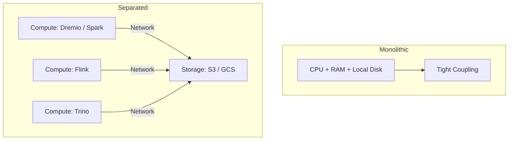
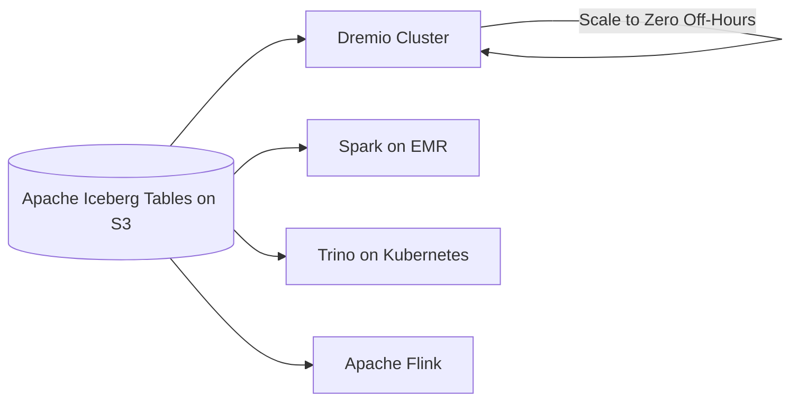

# Separation of Compute and Storage

## Core Definition

Separation of Compute and Storage is an architectural principle in which the processing layer (compute engines that execute queries and transformations) and the persistence layer (object storage that holds the data files) are deployed as independent, separately scalable infrastructure components with no physical coupling between them.

This principle is the architectural foundation of the modern cloud data lakehouse and represents a fundamental departure from the traditional monolithic data warehouse design, where compute and storage were tightly coupled on the same physical servers. Understanding why this separation matters, and how it enables the economics and flexibility of the open lakehouse, is essential for any data engineer working in the modern cloud ecosystem.

## The Monolithic Legacy

In the original data warehouse architecture (Teradata, IBM Netezza, Oracle Exadata), data was stored on disk arrays physically co-located with the database server's CPU and RAM. The query engine read data from local disk into local memory, processed it using local CPU, and returned results. This design made sense when network bandwidth was slow and expensive: moving data over a network was the primary bottleneck.

This tight coupling created a fundamental operational problem: compute and storage scale at different rates driven by different business pressures. A retail company might need to store three years of transaction history (a storage problem) while only needing to process this month's data at query time (a compute problem). With coupled systems, scaling storage required buying more servers, which also added compute capacity that was not needed. Scaling compute for quarter-end reporting peaks required buying more servers, which also added storage capacity that was not needed.

## The Cloud Object Storage Revolution

The emergence of affordable, infinitely scalable cloud object storage (Amazon S3 (2006), Google Cloud Storage (2010), Azure Blob Storage (2010)) changed the economics of data storage fundamentally. Object storage provides:

- **Near-infinite capacity:** Exabytes of storage with no provisioning or pre-planning required.
- **Extreme durability:** 11 nines (99.999999999%) data durability through redundant replication.
- **Pay-per-byte pricing:** Pay only for the storage actually used, with no minimum commitments.
- **High aggregate throughput:** Object storage systems deliver hundreds of GB/s aggregate throughput when accessed from many parallel clients simultaneously.

When data is stored in open formats (Parquet, ORC) on object storage, any compute engine that can read those formats from S3-compatible endpoints can process that data, from any network location, at any scale, spun up on demand and destroyed when not needed.

## How Separation Enables the Lakehouse

**Independent Scaling:** Storage scales independently of compute. Add more data to S3 without provisioning any new servers. Scale up the compute cluster to handle a reporting peak, then scale back to zero when the peak passes: the data remains safely in S3.

**Elastic, Ephemeral Compute:** Query engines (Dremio, Trino, Spark) run on ephemeral cloud instances (EC2 Spot instances, Kubernetes pods) that can be provisioned in minutes and destroyed immediately after query execution. An organization pays for compute only while queries are actively running, not while data sits idle waiting to be queried.

**Multi-Engine Access:** Because data lives in open formats on shared object storage, multiple different compute engines can access the same data simultaneously. The data science team runs Apache Spark for ML feature engineering; the BI team runs Dremio for interactive SQL analytics; the operational team runs Apache Flink for streaming ingestion: all over the same Apache Iceberg tables on the same S3 bucket.

**Data Durability Independent of Compute Failures:** When a compute node fails in a coupled system, data on that node may be at risk. With separated compute and storage, compute failures are completely isolated from data durability. The Iceberg tables on S3 are unaffected by any compute cluster failure.

## The Network Bandwidth Requirement

Separation of compute and storage introduces a network dependency that did not exist in coupled architectures. Query engines must read data from S3 over the network before they can process it. For analytics workloads scanning large datasets, this network I/O can be the primary performance bottleneck.

Modern cloud architectures address this through:

**Columnar Formats (Parquet/ORC):** Reading only the specific columns needed for a query (projection pushdown) dramatically reduces the volume of data transferred from S3. A query over 3 of 100 columns reads only 3% of the data on disk.

**Predicate Pushdown to Storage:** Partition pruning and file skipping (guided by Iceberg's min/max statistics and bloom filters) reduce the number of files read from S3 before any data is transferred to compute nodes.

**Compute Placement:** Cloud providers allow compute clusters to be launched in the same AWS region and availability zone as the S3 bucket, minimizing inter-region data transfer costs and maximizing network bandwidth between compute and storage.

**Caching Layers:** Query engines like Dremio maintain a local SSD-based Reflections cache (pre-computed materialized aggregations) that eliminates repeated S3 reads for frequently accessed datasets.

## Cost Economics

The cost economics of separated compute and storage are compelling:

**Storage costs** on S3 Standard are approximately $0.023/GB/month. Storing 100TB of data costs $2,300/month, far less than the capital expenditure of purchasing disk arrays.

**Compute costs** on AWS for a 10-node Dremio cluster running EC2 r6i.4xlarge instances are approximately $3,800/month if running 24/7. But with elastic provisioning, the same cluster running 8 hours/day (business hours only) costs approximately $1,267/month: a 67% reduction.

For workloads that run once per day or on-demand, serverless query services (Amazon Athena, Google BigQuery) charge only per-query ($5/TB scanned for Athena), making compute costs for low-frequency analytical workloads near-zero.

## Visual Architecture

### Diagram 1: Monolithic vs. Separated Architecture

### Diagram 2: Elastic Compute over Shared Storage

