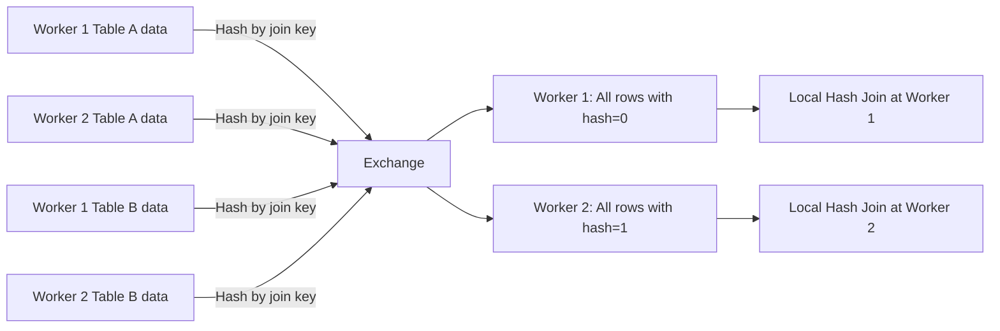
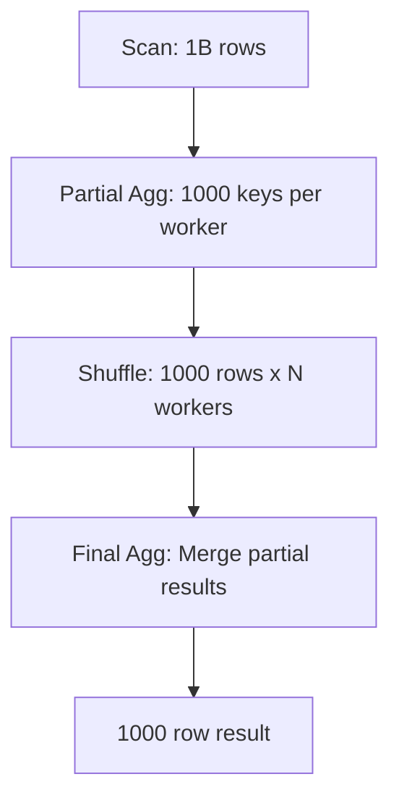

# Shuffle

## Core Definition

In distributed query execution, a Shuffle (also called an Exchange or Repartition) is the operation of redistributing data rows across the worker nodes of a compute cluster so that rows that must be processed together end up on the same worker. Shuffle is the foundational data movement primitive that enables distributed joins, aggregations, sorts, and window functions — operations that require co-locating rows with matching keys on the same execution unit.

Shuffle is universally recognized as the most expensive operation in distributed query execution. It requires every worker to: serialize its output rows into a wire format, send them over the network to (potentially) every other worker, receive rows from all other workers, and deserialize them. For large datasets, this network transfer dominates total query latency and consumes significant network bandwidth, memory, and CPU cycles for serialization/deserialization.

Understanding shuffle mechanics allows data engineers to write queries and design data layouts that minimize shuffle volume — one of the highest-leverage performance optimizations in distributed analytics.

## How Shuffle Works

**Step 1 — Partitioning:** The query planner selects a partitioning strategy that determines which worker will receive each row. The two primary strategies are:

- **Hash Partitioning:** Each row's join/group-by key is hashed, and the hash value modulo the number of workers determines the destination worker. All rows with the same key always route to the same worker. Used for joins and GROUP BY aggregations.
- **Range Partitioning:** The key space is divided into contiguous ranges, and rows route to workers based on their range. Produces a globally sorted output. Used for ORDER BY, sort-merge joins, and window functions requiring total order.

**Step 2 — Serialization:** Each worker serializes its rows for each destination worker into network packets. Serialization format choices significantly impact shuffle performance. Apache Arrow's IPC format (used by Dremio) enables zero-copy deserialization on the receiving end. Protocol Buffers and Thrift are alternatives with higher deserialization overhead.

**Step 3 — Network Transfer:** Serialized row buffers are sent from each source worker to each destination worker. In a cluster of n workers, a shuffle involves up to n² network connections simultaneously. Network bandwidth is often the bottleneck for large shuffles.

**Step 4 — Deserialization and Buffering:** Each receiving worker deserializes incoming row buffers and accumulates them in memory (or spills to disk if memory is insufficient) until all source workers have finished sending. The receiving worker then processes its complete partition.

## Shuffle in Join Execution

For a distributed hash join between two large tables (both too large to broadcast), the shuffle step ensures all rows with the same join key end up on the same worker:

1. Both tables are partitioned using the same hash function on the join key columns.
2. All rows with join key hash = 0 go to Worker 0; hash = 1 go to Worker 1; etc.
3. Each worker independently performs a hash join on its partition of both tables.

The total data moved across the network equals the sum of both table sizes — which for large tables can be terabytes of network traffic.

## Shuffle in Aggregation

For a distributed GROUP BY aggregation, shuffle co-locates all rows with the same grouping key on the same worker for final aggregation:

1. **Partial Aggregation (Pre-Shuffle):** Each worker first applies a local partial aggregation to its scan output, reducing the data volume before the shuffle. SUM, COUNT, MIN, MAX can be partially computed locally before shuffling. This pre-aggregation can reduce shuffle volume dramatically when the data has high key cardinality concentration.

2. **Shuffle:** Partially aggregated rows are shuffled by the grouping key.

3. **Final Aggregation:** Each worker performs final aggregation on its received partial aggregates.

If a table has 1 billion rows but only 1,000 distinct product categories, the partial aggregation reduces each worker's contribution from millions of rows to 1,000 rows before the shuffle — reducing network traffic by 1000x.

## Avoiding Shuffle

**Partition Matching:** If two tables that will be joined are both partitioned (physically stored) using the same partitioning scheme on the join key, and the data is already co-located (on the same worker or storage node), no shuffle is needed. Some distributed storage systems (HDFS with locality-aware allocation) support this, but cloud object storage (S3, GCS) makes co-location impossible — data on S3 is not "owned" by any specific worker.

**Broadcast Join:** Replace the shuffle of the smaller table with a broadcast, eliminating the shuffle of that side entirely (but still requiring network transfer of the build side to all workers).

**Pre-Partitioned Writes:** Write data to Iceberg with distribution by join key (e.g., `DISTRIBUTE BY customer_id`) so that files are organized by the same hash partitioning the query engine will use. Some advanced lakehouse systems can leverage this physical layout to skip the shuffle for matching joins — though this optimization requires tight integration between writer and reader.

## Visual Architecture

### Diagram 1: Shuffle for Distributed Hash Join

### Diagram 2: Partial Aggregation Before Shuffle

