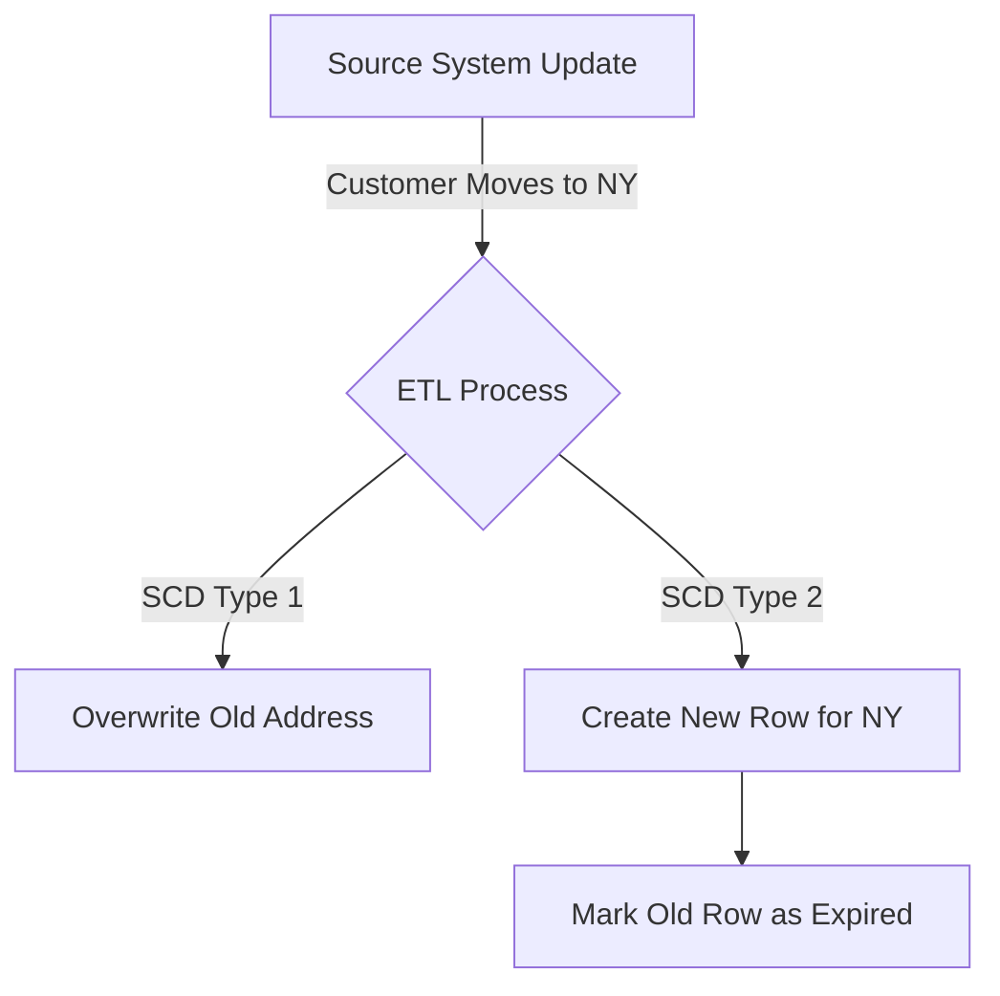
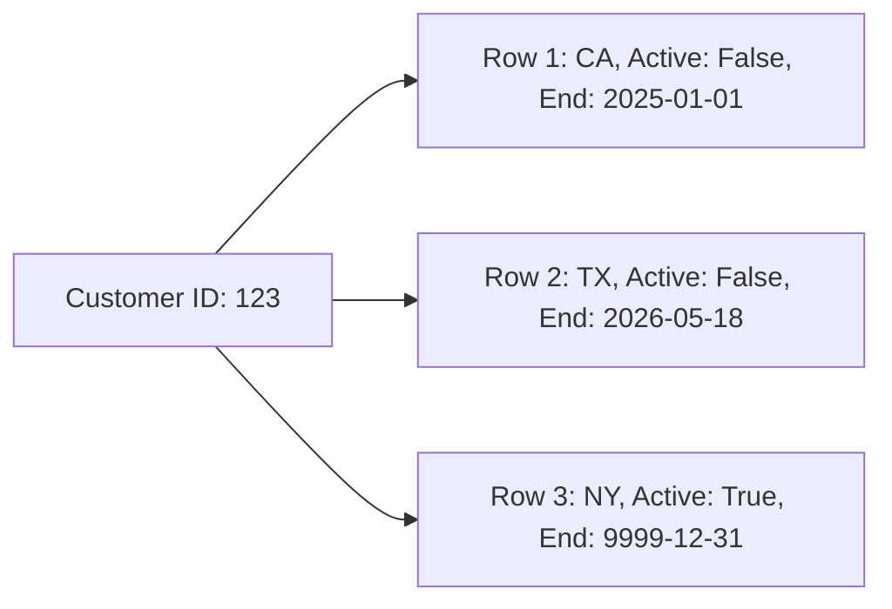

# Slowly Changing Dimensions (SCD)

## Core Definition

Slowly Changing Dimensions (SCD) is a fundamental concept in data warehousing that deals with a critical problem: How do you handle dimensional data that changes over time? 

If a customer lives in California in 2025, buys a television, and then moves to New York in 2026 and buys a laptop, how should the data warehouse represent this? If the marketing team runs a historical report for "Total Sales in California in 2025," that television sale must be attributed to California. The fact that the customer *currently* lives in New York should not retroactively alter the geographical context of a past historical event.

To solve this, data engineers employ various SCD methodologies, classified by "Types."

## Implementation and Operations

**SCD Type 1: Overwrite**
The simplest approach. When the source system updates, the data warehouse simply overwrites the old record. 
- *Pros:* Extremely easy to implement. Keeps the dimension table small.
- *Cons:* Complete loss of historical context. Any historical reports run today will look completely different than reports run yesterday, destroying trust in the data. Only used for correcting typos or for fields where history is legally required to be destroyed.

**SCD Type 2: Add New Row (The Industry Standard)**
When the customer moves to New York, the data warehouse does *not* overwrite the old California record. Instead, it creates a brand new row for that customer.
The table relies on specific tracking columns:
- `is_current` (Boolean flag)
- `effective_start_date`
- `effective_end_date`

The old California row gets its `is_current` flag set to FALSE, and the `effective_end_date` is stamped. The new New York row is inserted with `is_current` set to TRUE. Because the Data Warehouse uses its own generated Surrogate Keys, the Fact table linking to the 2025 purchase points to the specific California surrogate key, while new purchases point to the New York surrogate key. This perfectly preserves historical accuracy.

**SCD Type 3: Add New Column**
Instead of adding a new row, a new column is added to the table (e.g., `current_state` and `previous_state`).
- *Pros:* Easy to query both the current and immediate previous state.
- *Cons:* Only preserves one layer of history. If the customer moves a third time, the original state is lost. Rarely used in modern architectures.

## How This Fits the Wider Platform

To fully appreciate this concept, it is essential to understand the modern data engineering field, the challenges it solves, and the advanced architectural paradigms that support it. The transition from legacy monolithic architectures to modern, distributed open data lakehouses has fundamentally altered how data is modeled, orchestrated, and maintained.

### The Evolution of Data Architecture
Historically, data engineering was synonymous with Extract, Transform, Load (ETL). Teams used heavy, proprietary, on-premises tools like Informatica to pull data, transform it on specialized intermediate servers, and load it into rigid, heavily normalized Enterprise Data Warehouses (like Oracle or Teradata). This approach was brittle. If the business wanted a new column, it required weeks of database administration, schema alterations, and ETL pipeline rewrites.

The advent of cloud computing and the separation of compute and storage led to the Extract, Load, Transform (ELT) paradigm. Today, engineers extract raw data (JSON, CSV, API payloads) and load it directly into cheap cloud object storage (Amazon S3, Google Cloud Storage). The transformation happens *after* the load, utilizing the massive, elastic compute power of the cloud data warehouse (Snowflake) or lakehouse engine (Trino, Dremio, Spark). This allows teams to store everything and only pay for the compute required to transform the data when it is actually needed.

### The Critical Role of Orchestration
As pipelines grew from dozens of scripts to thousands of interdependent tasks, orchestration became the central nervous system of data engineering. A modern orchestrator (like Apache Airflow, Dagster, or Prefect) does far more than schedule jobs. It manages:
*   **Dependency Resolution:** Ensuring that a downstream sales dashboard does not update until *all* upstream data extraction and transformation tasks for that day have successfully completed.
*   **Idempotency and Backfilling:** Designing tasks so that if a pipeline fails and is rerun, it produces the exact same result without duplicating data. If a bug is discovered in last month's transformation logic, the orchestrator handles the "backfill," automatically rerunning the pipeline for the last 30 days of historical data.
*   **Alerting and Observability:** Integrating with PagerDuty, Slack, and Datadog to instantly notify on-call engineers when a data quality test fails or a source API goes down.

### Data Modeling in the Lakehouse Era
While the physical storage mechanisms have changed (from proprietary blocks on hard drives to open source Apache Parquet files on S3), the logical business requirements have not. Ralph Kimball's Dimensional Modeling techniques remain the absolute gold standard for analytical data presentation.

However, the implementation of these models has evolved. In an open data lakehouse utilizing Apache Iceberg:
1. **The Bronze Layer (Raw):** Data lands exactly as it arrived from the source. It is append-only and highly volatile.
2. **The Silver Layer (Cleaned & Normalized):** Data is parsed, deduplicated, and cast to correct data types. PII is masked. It resembles a normalized (3NF) operational database.
3. **The Gold Layer (Dimensional/Business):** Data is heavily denormalized into Star Schemas (Fact and Dimension tables) explicitly designed for high-performance querying by BI tools and executives.

### Best Practices for Pipeline Reliability
To maintain these complex systems, data engineers have adopted practices from traditional software engineering:
*   **Data Quality Testing:** Utilizing frameworks like Great Expectations or dbt tests to automatically assert that data is not null, primary keys are unique, and values fall within accepted ranges *before* the data is published to production.
*   **Write-Audit-Publish (WAP):** Utilizing the branching capabilities of formats like Apache Iceberg (similar to Git branching) to write data to a hidden branch, run audit queries against it, and only merge it to the main production branch if it passes all quality checks. This guarantees that consumers never see corrupted or partial data.
*   **CI/CD for Data:** Storing all SQL transformations (dbt models), Python orchestration code (Airflow DAGs), and infrastructure configuration (Terraform) in Git. Changes are reviewed via Pull Requests, and automated CI/CD pipelines deploy the changes to staging and production environments.

### Conclusion
These concepts are not isolated techniques. Designing a Star Schema, setting the block size of a Parquet file, and writing the DAG that orchestrates the workflow all serve one goal: delivering reliable, performant data the business can act on.

## Visual Architecture

### Diagram 1: Conceptual Architecture

### Diagram 2: Operational Flow

