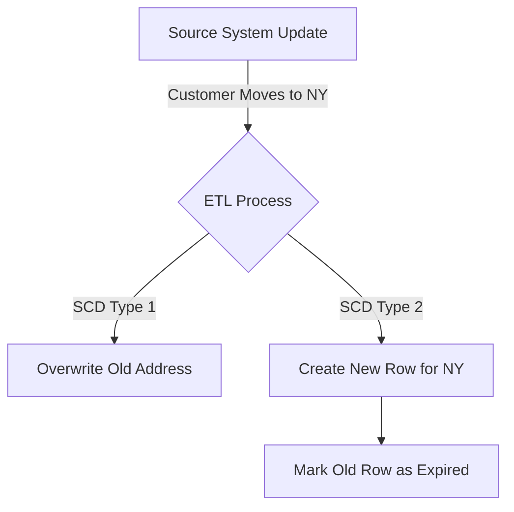
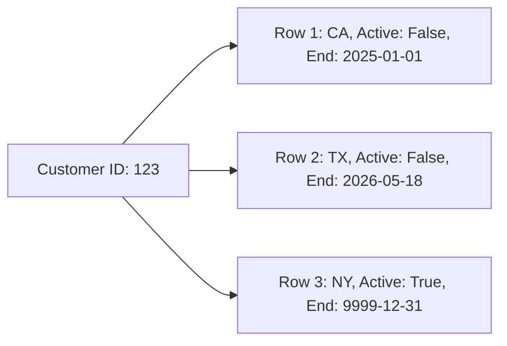

# Slowly Changing Dimensions (SCD)

## Core Definition

Slowly Changing Dimensions (SCD) is a fundamental concept in data warehousing that deals with a critical problem: How do you handle dimensional data that changes over time? 

If a customer lives in California in 2025, buys a television, and then moves to New York in 2026 and buys a laptop, how should the data warehouse represent this? If the marketing team runs a historical report for "Total Sales in California in 2025," that television sale must be attributed to California. The fact that the customer *currently* lives in New York should not retroactively alter the geographical context of a past historical event.

To solve this, data engineers employ various SCD methodologies, classified by "Types."

## Implementation and Operations

**SCD Type 1: Overwrite**
The simplest approach. When the source system updates, the data warehouse simply overwrites the old record. 
- *Pros:* Extremely easy to implement. Keeps the dimension table small.
- *Cons:* Complete loss of historical context. Any historical reports run today will look completely different than reports run yesterday, destroying trust in the data. Only used for correcting typos or for fields where history is legally required to be destroyed.

**SCD Type 2: Add New Row (The Industry Standard)**
When the customer moves to New York, the data warehouse does *not* overwrite the old California record. Instead, it creates a brand new row for that customer.
The table relies on specific tracking columns:
- `is_current` (Boolean flag)
- `effective_start_date`
- `effective_end_date`

The old California row gets its `is_current` flag set to FALSE, and the `effective_end_date` is stamped. The new New York row is inserted with `is_current` set to TRUE. Because the Data Warehouse uses its own generated Surrogate Keys, the Fact table linking to the 2025 purchase points to the specific California surrogate key, while new purchases point to the New York surrogate key. This perfectly preserves historical accuracy.

**SCD Type 3: Add New Column**
Instead of adding a new row, a new column is added to the table (e.g., `current_state` and `previous_state`).
- *Pros:* Easy to query both the current and immediate previous state.
- *Cons:* Only preserves one layer of history. If the customer moves a third time, the original state is lost. Rarely used in modern architectures.

## The Types That Matter in Practice

The numbered SCD types are often listed exhaustively. Three are common, and the rest are worth recognizing but rarely chosen.

**Type 1 overwrites.** The row is updated in place and prior values are lost. Correct for fixing errors, since nobody wants to preserve the history of a misspelling. Wrong for anything where history has meaning, because historical reports silently change.

**Type 2 adds a row.** A change closes the current row and inserts a new one, with validity dates and usually a current flag. Facts join to the row that was valid at the time of the event, so historical reports stay stable. This is the default when the dimension describes something whose state at a point in time matters.

**Type 3 adds a column.** A `previous_value` column alongside the current one. Only supports one step of history, and is used where a single before-and-after comparison is the requirement, such as a recent reorganization.

Types 0, 4, and 6 exist: retain-original, split current from history into separate tables, and a hybrid of 1, 2 and 3. Type 4 is worth remembering when a dimension has both slowly and rapidly changing attributes.

### Implementing Type 2 on Iceberg

The mechanics are a `MERGE` doing two things: closing the currently open row for a changed key, and inserting its replacement.

```sql
MERGE INTO dim_customer t
USING staged_customers s
ON t.customer_id = s.customer_id AND t.is_current = true
WHEN MATCHED AND (t.tier <> s.tier OR t.region <> s.region) THEN
  UPDATE SET t.is_current = false, t.valid_to = s.effective_date
WHEN NOT MATCHED THEN
  INSERT (customer_id, tier, region, valid_from, valid_to, is_current)
  VALUES (s.customer_id, s.tier, s.region, s.effective_date, DATE '9999-12-31', true)
```

Two details cause most of the trouble. The comparison must list exactly the attributes whose changes should create history; including a column that changes on every load produces a new row every load. And a single `MERGE` cannot both close a row and insert its replacement for the same key in one pass, so the insert is normally handled as a second step or by preparing the staged set so both operations target different rows.

### The Cost Nobody Budgets For

A Type 2 dimension grows with change, not with entities. A customer dimension of two million customers whose tier is recalculated monthly gains two million rows a month.

On a copy-on-write table, each merge rewrites every file containing a changed row, so the write cost rises with dimension size rather than change volume. Merge-on-read shifts that cost to reads and requires compaction to stay ahead of accumulated deletes. Choosing between them is the main physical decision a Type 2 dimension forces.

## Visual Architecture

### Diagram 1: Conceptual Architecture



### Diagram 2: Operational Flow


