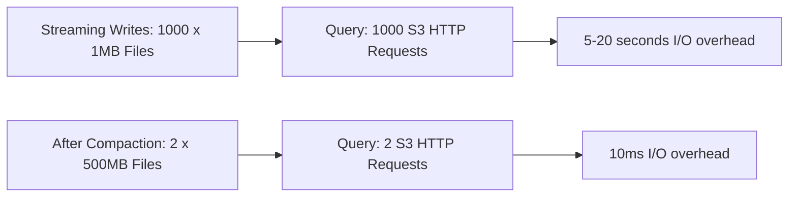
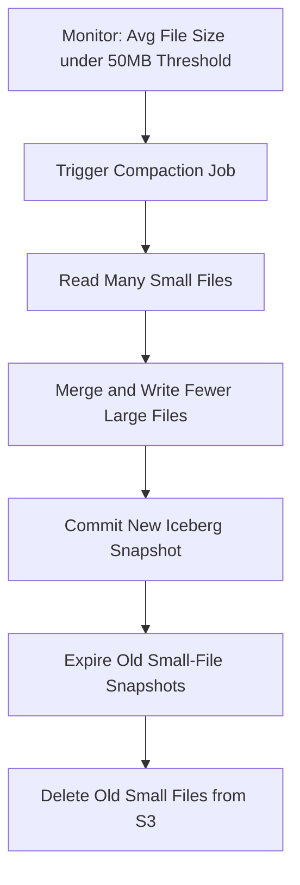

# Small File Problem

## Core Definition

The Small File Problem refers to the performance and operational degradation that occurs when a data lake or lakehouse accumulates a very large number of small data files instead of a smaller number of optimally sized files. A table with 1TB of data split across 1,000,000 × 1MB files performs dramatically worse than the same 1TB split across 2,000 × 500MB files — both in query execution speed and in catalog metadata management.

The problem is ubiquitous in streaming and near-real-time ingestion pipelines, where each micro-batch write produces a small set of files. A pipeline writing 60 micro-batches per hour over 12 months produces 525,600 write events — each potentially creating 1-10 new files. Without compaction, the table accumulates millions of small files that cripple query performance.

## Why Small Files Hurt Performance

**File Open Overhead per S3 API Call:** Reading a file from Amazon S3 requires an HTTP GET request with fixed overhead regardless of file size. The first few hundred kilobytes of the request take 5-20ms just to establish the connection and read the response headers. Reading 1000 files of 1MB each requires 1000 HTTP requests with 5-20ms each = 5-20 seconds of I/O overhead, completely dominating the ~0.8 seconds of actual data transfer at 1 Gbps network throughput.

**Thread Utilization Waste:** Query engines parallelize data reading by assigning files to worker threads. When files are tiny, each thread processes its file in milliseconds and then idles waiting for more work, while the coordinator struggles to dispatch millions of file assignments fast enough to keep all threads busy. For extremely small files (< 1MB), thread management overhead may exceed actual data processing time.

**Manifest File Explosion:** Apache Iceberg's manifest files track the list of data files for each snapshot. With millions of small files, the manifest files themselves become very large (each data file entry requires metadata: file path, record count, column statistics). Reading and processing millions of manifest entries during query planning adds significant latency even before any data is read.

**Metadata Catalog Pressure:** Each Iceberg snapshot records the full manifest list for the table state. With millions of small files accumulated across thousands of micro-batch snapshots, the metadata overhead — both in storage space and in catalog read latency — becomes substantial.

**JVM Garbage Collection Pressure:** In JVM-based query engines (Dremio, Trino), each file path string and metadata object is a JVM object on the heap. Millions of file entries cause JVM garbage collection to work harder, introducing GC pauses that cause unpredictable query latency spikes.

## The Streaming Ingestion Root Cause

Small files are a natural byproduct of streaming and near-real-time data ingestion:

**Kafka-to-Iceberg streaming:** Apache Flink or Spark Structured Streaming reading from Kafka commits micro-batches to Iceberg at configurable intervals (30 seconds, 1 minute). Each commit creates a new snapshot with new data files. Even at moderate throughput (100MB/min of incoming data), 1-minute micro-batches create 100MB files — still small for a table intended for batch analytics.

**Event-driven pipeline writes:** Serverless functions triggered by events (AWS Lambda, Google Cloud Functions) may each write a tiny amount of data to S3 as individual files. Accumulated over time, these create severe small file fragmentation.

**Incremental dbt runs:** dbt incremental models appending new records on each run (every hour or every 15 minutes) create a new file per run per partition. After a year of hourly runs over a date-partitioned table: 8,760 files for a single partition.

## Solutions: Compaction

The primary solution to the small file problem is **compaction** (also called file optimization or rewriting): periodically rewriting many small files into fewer, larger files without changing the logical table contents.

**Apache Iceberg Compaction Procedures:**

```sql
-- Rewrite small data files into larger optimally sized files
CALL catalog.system.rewrite_data_files(
  table => 'db.my_table',
  strategy => 'binpack',
  options => map('target-file-size-bytes', '536870912')  -- 512MB target
);

-- Rewrite manifests to consolidate small manifest files
CALL catalog.system.rewrite_manifests('db.my_table');
```

The `binpack` strategy uses a bin-packing algorithm to group small files into bins targeting the configured file size. Dremio's `OPTIMIZE TABLE` command executes the equivalent compaction transparently with intelligent defaults.

**Automated Compaction Triggers:** The most effective approach schedules compaction automatically based on metrics: trigger compaction when the average file size falls below a threshold (e.g., 50MB) or when the total file count exceeds a threshold (e.g., 10,000 files per partition). Apache Iceberg's metadata provides these metrics via `files` table queries.

**Target File Size:** The optimal target file size balances parallelism (too large = few files, underutilizing the cluster) and overhead (too small = small file problem). Industry standard is 256MB-1GB per file. Dremio recommends 256MB as a starting point.

## Visual Architecture

### Diagram 1: Small Files vs Optimal Files



### Diagram 2: Compaction Workflow


