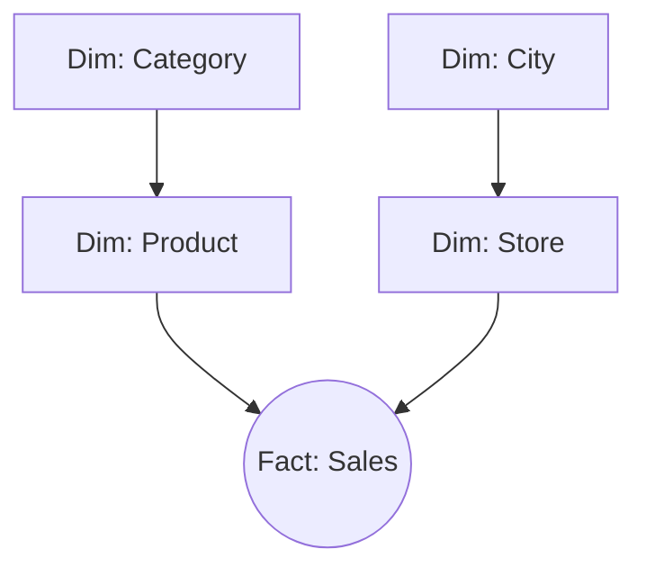
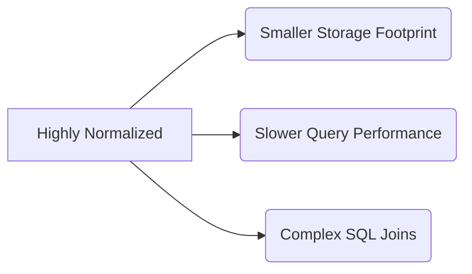

# Snowflake Schema

## Core Definition

The Snowflake Schema is a logical arrangement of tables in a multidimensional database that is an extension and variation of the Star Schema. The core difference lies in how the Dimension tables are handled. 

While a Star Schema heavily denormalizes (flattens) data to ensure that every dimension is a single table, the Snowflake Schema completely normalizes its dimension tables to eliminate data redundancy. Because the dimension tables are split into multiple related tables radiating outward, the resulting Entity-Relationship Diagram looks like the complex, branching structure of a snowflake.

## Implementation and Operations

Using the retail example, in a Star Schema, the `dim_product` table would contain both the `product_name` and the `category_name`. If a million products belong to the "Electronics" category, the word "Electronics" is written a million times in that table.

In a Snowflake Schema, the data is normalized. The `dim_product` table contains the `product_name` and a `category_id`. A separate, new table called `dim_category` is created, which contains the `category_id` and the `category_name`. 

**Tradeoffs:**
The primary advantage of the Snowflake Schema is storage efficiency. By eliminating redundancy, it saves disk space and makes it faster to update dimensional data (e.g., if a category name changes, you only update one row in `dim_category` instead of a million rows in `dim_product`).

However, in modern open data lakehouses (using technologies like Apache Iceberg and Amazon S3), storage is incredibly cheap, while CPU compute time is expensive. The Snowflake Schema requires significantly more complex SQL to query. To analyze revenue by category, the query engine must now `JOIN` the Fact table to the Product table, and *then* `JOIN` the Product table to the Category table. These cascading joins create massive CPU overhead and severely degrade analytical query performance. Consequently, the industry heavily favors the Star Schema over the Snowflake Schema for modern analytics.

## The Trade Against a Star

A snowflake schema normalises dimensions into further tables. Rather than one `dim_product` carrying category and department as text columns, the product dimension holds a category key pointing to `dim_category`, which holds a department key, and so on.

The original argument was storage. Repeating "Consumer Electronics" on every product row wasted space that mattered when storage was billed by the gigabyte on specialised hardware.

That argument no longer holds. Dictionary encoding in Parquet stores each distinct category string once per column chunk and replaces occurrences with small integers, which achieves most of the saving normalization was meant to deliver, without adding a join.

### What Normalizing Still Costs

Every additional level is another join at query time. A question grouping sales by department now traverses fact to product to category to department, and the engine can no longer broadcast a single small dimension. Query plans become deeper and more sensitive to the optimizer making good choices.

The larger cost is on the people writing queries. A star lets an analyst join the fact to the dimensions they need. A snowflake requires knowing which chain of tables leads to the attribute, and that knowledge lives in documentation or in someone's memory.

### When It Is Still Justified

**Genuinely shared hierarchies.** When several dimensions reference the same hierarchy and it must be maintained in one place, a shared sub-dimension is the honest structure. Duplicating it invites divergence.

**Very large dimensions with repetitive attribute groups.** When a dimension itself reaches hundreds of millions of rows, the storage argument regains some force.

**Regulated attributes.** When a set of attributes has separate access rules, separating them into their own table makes the boundary enforceable at the catalog rather than through column masking.

### The Practical Position

For most lakehouse work, model as a star and normalize only where a specific reason applies. The semantic layer can present a clean star to consumers even where physical tables are normalized, which removes most of the usability argument for keeping the snowflake visible.

## Visual Architecture

### Diagram 1: Conceptual Architecture

### Diagram 2: Operational Flow

