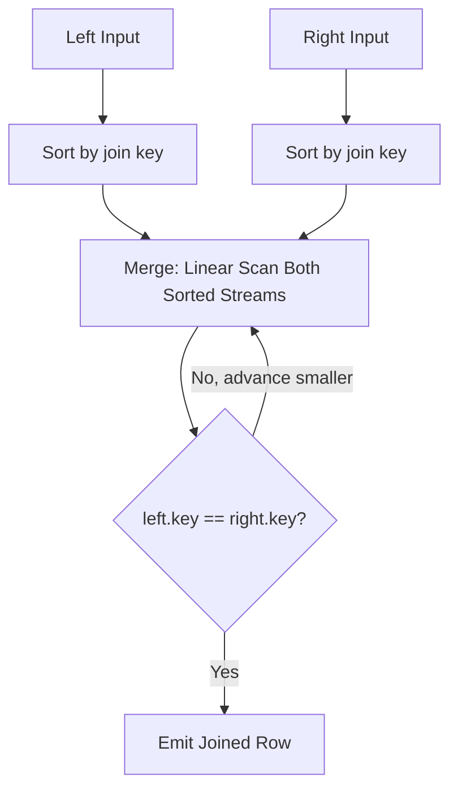
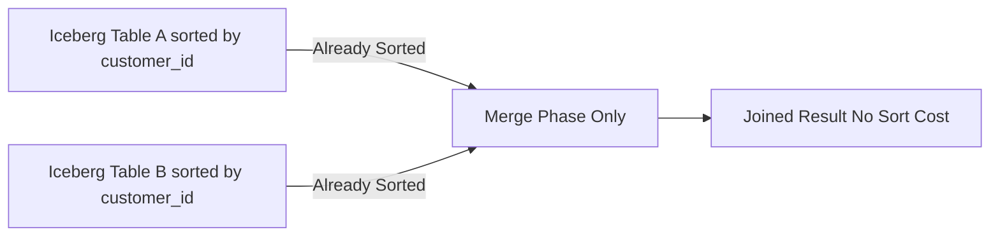

# Sort-Merge Join

## Core Definition

A Sort-Merge Join (SMJ) is a join algorithm that sorts both input relations by their join key and then performs a single linear merge pass through both sorted streams simultaneously, matching rows with equal keys and emitting joined results. It is particularly efficient when both input relations are already sorted on the join key — in which case the sort phase is eliminated entirely and only the inexpensive merge phase remains.

Sort-merge joins are the optimal algorithm for large-to-large joins where neither side fits in memory for a hash join and both inputs are already sorted (or sorting them is acceptable). They produce sorted output, which can be exploited by downstream operators (like ORDER BY or subsequent sort-merge joins on the same key).

## The Algorithm in Detail

**Phase 1 — Sort:** Both input relations are sorted by their join key columns using an external merge sort algorithm if the data exceeds available memory. If the data is already physically sorted (e.g., an Apache Iceberg table with a defined `sort_order_spec` on the join column), this phase is skipped entirely.

External merge sort divides the input into runs that fit in memory, sorts each run, writes it to disk, and then merges the sorted runs using a priority queue (k-way merge). For n rows with memory for m rows, external merge sort requires O(n log(n/m)) I/O operations.

**Phase 2 — Merge:** Two pointers advance through the two sorted input streams. At each step:
- If left.key < right.key: advance the left pointer (no match with any current right row).
- If left.key > right.key: advance the right pointer (no match with any current left row).
- If left.key == right.key: all left rows with this key must be joined with all right rows with this key. Emit all combinations.

The merge phase runs in O(n+m) time with O(1) additional memory (beyond the output buffer) because it processes both sorted streams in a single pass.

**Handling Duplicate Keys:** When many rows on both sides share the same join key (low cardinality join key or many-to-many joins), the merge phase may emit O(n×m) rows for that key value — a Cartesian product within each key group. This is correct behavior but can produce unexpectedly large intermediate results.

## When Sort-Merge Join is Preferred

**Pre-Sorted Inputs:** The most compelling case. Apache Iceberg tables defined with a sort order spec (e.g., `WRITE_ORDER BY customer_id`) are physically organized with rows sorted by that column within each data file. If a query joins two Iceberg tables on `customer_id` and both tables have the same sort order, the query planner can use a merge join without any sorting step — reading two sorted streams from storage and merging them directly.

Dremio and Trino recognize sort order metadata in Iceberg tables and leverage it during join planning, skipping sort operators when the physical ordering of data files matches the join key order.

**Range Joins:** Sort-merge joins support non-equi range join conditions (e.g., `a.start_time BETWEEN b.start_time AND b.end_time`) more naturally than hash joins, which require equi-join conditions. After sorting both sides by the start_time, the merge step can efficiently find all overlapping ranges.

**Memory-Constrained Environments:** Sort-merge joins require only O(1) memory during the merge phase (beyond sort memory). When memory is severely constrained and the build side of a hash join would require extensive spilling, a sort-merge join — which predictably requires only sort memory — may be preferable.

## Distributed Sort-Merge Join

In distributed execution, a sort-merge join requires both inputs to be globally sorted, not just locally sorted. This requires a **range partition exchange** (as opposed to the hash partition exchange used in shuffle hash joins):

**Range Partitioning:** The key space is divided into contiguous ranges (e.g., customer_ids 1-1M go to Worker 1, 1M-2M go to Worker 2, etc.). Rows are routed to workers based on which range their join key falls in. After the exchange, each worker holds a contiguous range of the key space from both input tables.

**Local Sort-Merge:** Each worker sorts its received rows (if not already sorted) and performs a local sort-merge join on its key range.

Range partitioning produces a globally sorted output, enabling downstream operators that require sorted input (ORDER BY, window functions with ORDER BY) to skip sorting.

## Iceberg Sort Order Integration

Apache Iceberg's `sort_order_spec` records the physical sort order of data files within a table. When a query engine plans a sort-merge join and reads from an Iceberg table with a matching sort order, it can use the data files' pre-existing sort order for the merge without loading all data into memory for sorting.

This optimization — sometimes called "external sort elimination" — is particularly valuable for Iceberg tables with write-time sorting (produced by Dremio's `CTAS ... DISTRIBUTE BY ... SORT BY` or Spark's `sortBy()` before writing) where the sort order matches common join patterns.

## Visual Architecture

### Diagram 1: Sort-Merge Join Algorithm

### Diagram 2: Pre-Sorted Iceberg Tables Skip Sort Phase

