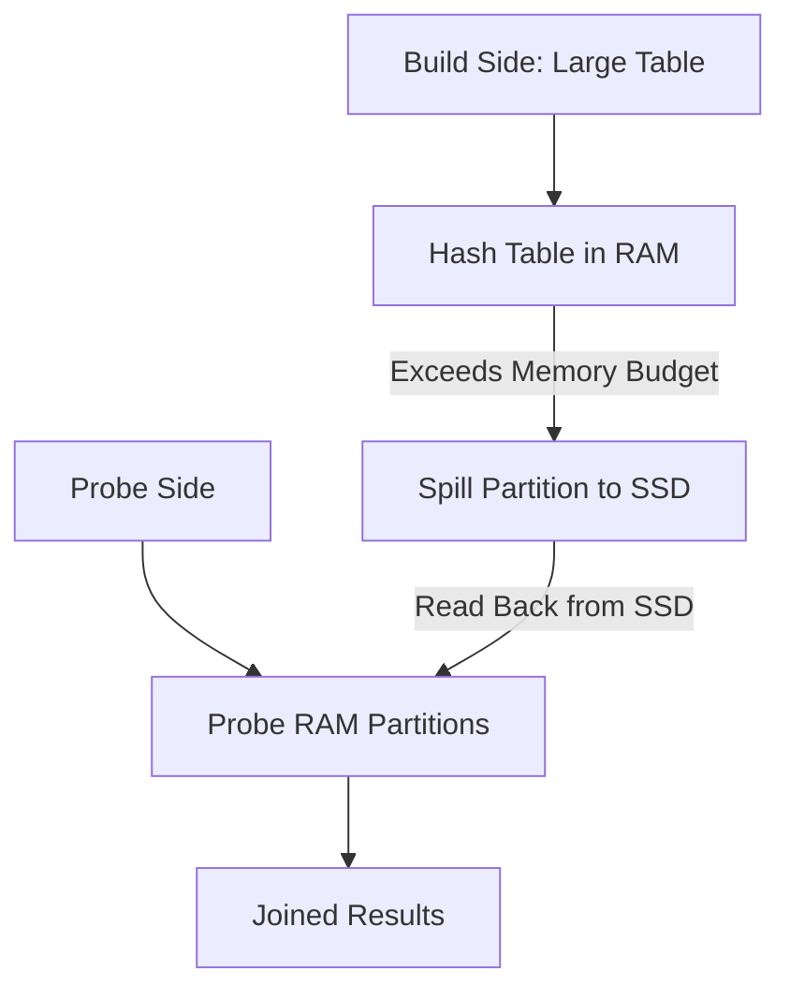
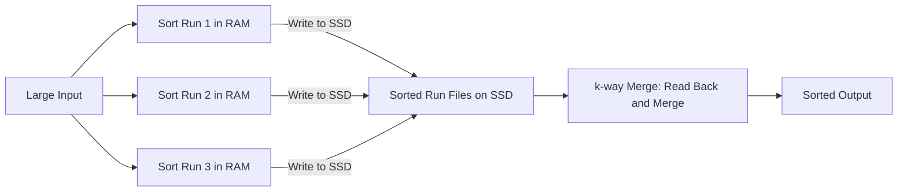

# Spilling to Disk

## Core Definition

Spilling to Disk is a query engine mechanism that writes intermediate query results — hash tables, sort buffers, shuffle data — to local disk storage when the data exceeds the available memory allocated to a query or operator. Spilling allows the query engine to process datasets larger than RAM without failing with an out-of-memory error, at the cost of significantly increased query latency.

The name reflects the physical metaphor: just as a container that is too full "spills" its contents, a query operator that accumulates more data than its memory allocation spills the excess to disk for temporary storage and retrieves it as needed during processing.

Spilling to disk is the query engine's safety valve. Without it, queries over large datasets would simply fail whenever they exceeded available memory. With it, any query can complete on any dataset size — the only cost is performance degradation, which can be severe (10x-100x slower than fully in-memory execution).

## When Spilling Occurs

**Hash Join Build Phase:** A hash join builds an in-memory hash table from the build side. If the build side is larger than the memory budget allocated to the join operator, the engine spills hash table partitions to disk. During the probe phase, it reads spilled partitions back from disk one at a time, probing each against the matching probe-side partition.

**Sort Operations:** External merge sort divides the input into sorted runs that fit in memory, writes them to disk, then merges the sorted runs using a k-way merge. For very large inputs, each merge pass may itself need to spill intermediate merge results to disk (multi-level external merge sort).

**Hash Aggregation:** GROUP BY aggregations build in-memory hash maps keyed by the grouping columns. For very high-cardinality aggregations (billions of distinct groups), the hash map may grow beyond available memory and must be spilled to disk.

**Shuffle (Exchange) Buffering:** In distributed execution, workers must buffer incoming shuffle data from all upstream workers before beginning processing. For very large shuffles, the per-worker receive buffer may exceed available memory, requiring shuffle data to be spilled to disk as it arrives.

## The Performance Impact of Spilling

Spilling to disk fundamentally changes the I/O pattern from RAM-speed (50-100 GB/s bandwidth) to SSD-speed (3-7 GB/s) or HDD-speed (100-200 MB/s). For large spills, this can make a query 10x to 100x slower than it would be with sufficient memory.

Modern cloud compute instances use NVMe SSD storage for spill targets, mitigating some of the performance impact compared to HDD. But even NVMe SSDs are 10-20x slower than RAM for random access patterns, and disk spilling doubles the I/O by requiring data to be written (during spill) and read back (during processing).

Beyond raw I/O cost, spilling can cause cascading effects: a spilling sort may cause downstream operators to wait, holding their memory allocations idle. Query engine schedulers may deprioritize spilling queries to protect memory for other queries, further increasing latency.

## Prevention Strategies

**Right-Size Worker Memory:** The most direct solution. Ensure worker nodes have sufficient RAM for the queries they execute. Memory requirements can be estimated from table statistics: hash join memory ≈ build side size × 1.5x (overhead); sort memory ≈ 2× data to sort in a single pass.

**Broadcast Joins:** Replace hash joins over large build sides with broadcast joins over small build sides, eliminating the large in-memory hash table requirement entirely.

**Partial Pre-Aggregation:** Apply GROUP BY partial aggregation before data reaches the aggregation operator, reducing the hash map size.

**Iceberg Data Organization:** Well-partitioned Iceberg tables reduce the scan volume per query, reducing the amount of data flowing through memory-intensive operators.

**Adaptive Query Execution (AQE):** Apache Spark's AQE and Dremio's dynamic planning can detect at runtime when a join's estimated build side size is larger than expected and switch from a hash join strategy (which would spill) to an alternative strategy (coalescing join partitions, broadcasting a smaller-than-estimated side).

**Query Resource Groups:** Isolate expensive queries in dedicated resource groups with memory limits that prevent them from impacting other concurrent queries.

## Monitoring Spilling

Query engines expose spill metrics in their execution statistics and EXPLAIN ANALYZE output:

- **Dremio:** `spilled_bytes` field in the query profile for each operator that spilled.
- **Trino:** `spilledBytes` in the query's plan summary.
- **Spark:** `Peak Execution Memory` and `Spill (Memory)`, `Spill (Disk)` in the Stage Details of the Spark UI.

Tracking spill frequency and volume across production queries helps identify which queries need memory tuning and which data models would benefit from restructuring to reduce shuffle and sort volumes.

## Visual Architecture

### Diagram 1: Hash Join with Spilling

### Diagram 2: External Merge Sort

