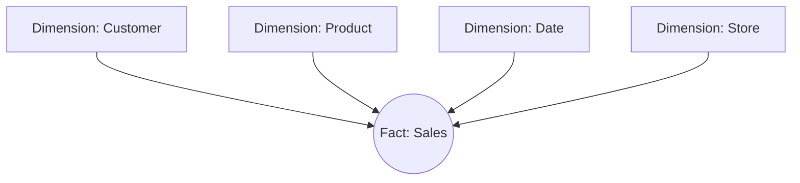
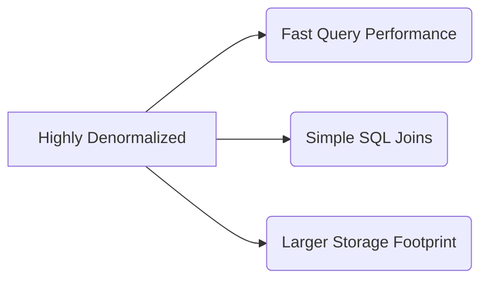

# Star Schema

## Core Definition

The Star Schema is the simplest and most widely utilized architectural pattern in dimensional data modeling, designed specifically for data warehouses and data marts. Developed by Ralph Kimball, it is engineered to optimize analytical querying (OLAP) performance.

It is called a "Star" schema because its Entity-Relationship Diagram visually resembles a star. At the exact center of the star is a massive, central table called the "Fact Table" (which stores quantitative, measurable transactional data). Radiating outward from the center are the points of the star, called "Dimension Tables" (which store descriptive attributes related to the facts).

## Implementation and Operations

In a retail business, the central **Fact Table** might be `fact_sales`. Every row represents a single line item on a receipt. It contains numerical metrics (Revenue, Quantity, Discount) and foreign keys pointing to the dimensions (e.g., `date_id`, `product_id`, `store_id`). This table usually contains millions or billions of rows but very few columns.

The surrounding **Dimension Tables** provide the context. The `dim_product` table might contain `product_id`, `product_name`, `category`, and `brand`. The `dim_store` table contains `store_id`, `city`, `state`, and `manager_name`. These tables have fewer rows but many descriptive columns.

The extreme advantage of the Star Schema is its simplicity. To analyze "Total Revenue by Category for Stores in California," an analyst only needs to write a query that joins the central Fact table to the Product and Store dimensions. Because the dimensions are denormalized (flattened), the database engine only needs to execute a single, highly performant `JOIN` operation per dimension, rather than navigating a complex web of heavily normalized tables. This structure is universally understood by Business Intelligence (BI) tools like Tableau and PowerBI.

## Why the Star Survived the Move to Object Storage

The star schema was designed when storage was expensive and joins were costly, and both constraints have changed. It remained the dominant pattern anyway, for reasons that turned out to be about people rather than machines.

A star has one fact table surrounded by dimension tables, each joined directly to the fact by a single key. No dimension joins to another dimension. That flatness means any question can be answered by joining the fact to the dimensions it needs, and an analyst does not have to know a traversal path.

### The Physical Case on a Lakehouse

Dimensions are usually small, often small enough to fit in memory on every executor. A query engine can therefore broadcast the dimension rather than shuffling both sides, turning the join into a hash lookup. Because a star has no dimension-to-dimension joins, this applies to every join in the query.

The fact table stays narrow, holding keys and measures rather than repeated descriptive text. On a columnar format this matters twice: narrow rows compress well, and queries that touch only a few columns read only those columns.

### Where It Breaks Down

**Very large dimensions.** A customer dimension with hundreds of millions of rows cannot be broadcast, and the join reverts to a shuffle. At that point the modeling advantage does not disappear, but the performance advantage does.

**High-cardinality attributes on the fact.** Order identifiers and transaction references have no dimension to belong to. Kimball's answer is the degenerate dimension: keep the value on the fact and accept that it has no lookup table.

**Rapidly changing attributes.** An attribute that changes often turns a Type 2 dimension into something that grows nearly as fast as the fact. Splitting it into a separate mini-dimension keyed from the fact is the usual remedy.

### The One Big Table Argument

A recurring counter-proposal is to denormalize everything into one wide table, on the reasoning that columnar storage makes wide tables cheap and joins are the expensive part.

It works for a specific reporting need and degrades as a general approach. Every dimension attribute change requires rewriting the fact rows that carry it, the same descriptive text is stored on every row, and there is no single place where a definition lives. The star's separation exists so that describing a customer and recording a sale remain separate concerns.

## Visual Architecture

### Diagram 1: Conceptual Architecture

### Diagram 2: Operational Flow

