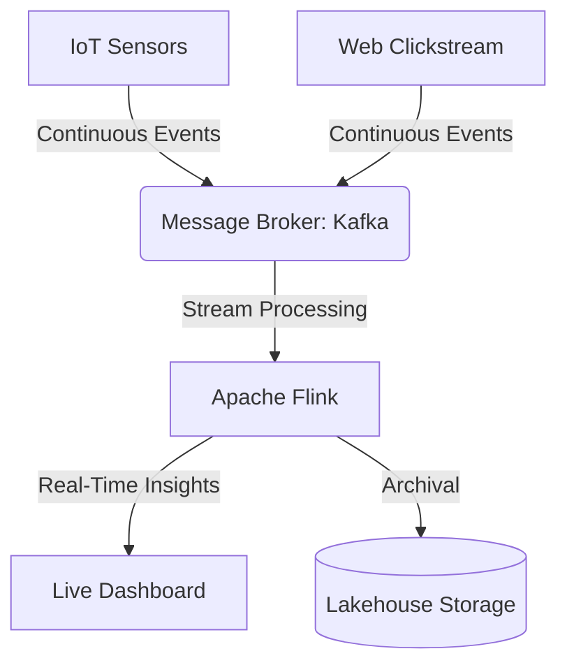
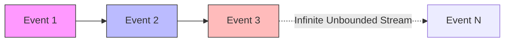

# Streaming Data

## Core Definition

Streaming Data refers to data that is continuously generated by thousands of data sources, which typically send in the data records simultaneously, and in small sizes (order of Kilobytes). Common examples include e-commerce clickstreams, in-game player activity, telemetry from IoT devices, and financial stock market feeds.

Unlike traditional batch data, which is bounded (it has a known, finite beginning and end, like "all sales from yesterday"), streaming data is unbounded. It is an infinite flow of events that never stops. Consequently, the architecture required to process streaming data is fundamentally different from traditional batch ETL pipelines.

## Implementation and Operations

Processing streaming data requires specialized infrastructure that can ingest millions of events per second, buffer them securely, and process them on the fly.

1.  **The Message Broker (The Buffer):** Systems like Apache Kafka, Amazon Kinesis, or Apache Pulsar sit at the front door of the architecture. They act as massive, highly available shock absorbers. If a website goes viral and suddenly generates a million clicks per second, the message broker absorbs and stores those events in distributed logs, preventing the downstream analytics engines from crashing under the load.
2.  **The Stream Processing Engine:** Technologies like Apache Flink, Apache Spark Structured Streaming, or ksqlDB connect to the message broker. Instead of running a query once against a static table, these engines run "Continuous Queries." The query is deployed to the cluster, and it stays alive forever, evaluating every single new event as it arrives from Kafka. 

These stream processors handle complex mathematical operations on unbounded data using **Windowing**. For example, instead of calculating the "total sum of all time," a stream processor uses a "Tumbling Window" to calculate the "total sum of transactions in the last 5 minutes," emitting a new aggregate value every 5 minutes to power live operational dashboards or real-time fraud detection algorithms.

## Event Time, Processing Time, and Why the Distinction Bites

Every streaming system must reconcile two clocks. **Event time** is when something happened. **Processing time** is when the system saw it. They differ because of network delay, buffering, retries, and devices that were offline.

Aggregating by processing time is simple and produces results that change depending on when the pipeline ran. Aggregating by event time is correct and requires deciding how long to wait for stragglers, because a window over Tuesday cannot be closed until you accept that no more Tuesday events will arrive.

**Watermarks** encode that decision. A watermark asserts that events older than a threshold are no longer expected, allowing windows to close and state to be released. Setting it long means high latency and large state; setting it short means late events are dropped or handled separately.

There is no correct value, only a trade priced in latency, memory, and completeness.

### Writing Streams into a Lakehouse

The tension between streaming and table formats is commit granularity. A stream produces a continuous flow; a table format publishes discrete atomic commits. Every commit produces at least one file and a new snapshot.

Committing every few seconds gives low latency and generates an enormous number of small files plus a snapshot history that grows without bound. Committing every few minutes produces reasonable files and moves latency into minutes.

Most production streaming ingestion settles between one and five minutes, paired with compaction running behind it and snapshot expiry keeping metadata bounded. Treating compaction as optional is the usual reason a streaming table becomes slow within weeks.

### Exactly-Once in Practice

Exactly-once processing is generally achieved as at-least-once delivery combined with idempotent writes, rather than by preventing duplicate delivery.

On a lakehouse this means the write step must be safe to repeat: a `MERGE` keyed on a natural key, a partition replaced wholesale, or a checkpoint recording which offsets were committed in which snapshot. The table format's atomic commit provides the boundary that makes this work, since a retried write either replaces the previous attempt or is rejected.

## Visual Architecture

### Diagram 1: Conceptual Architecture

### Diagram 2: Operational Flow

