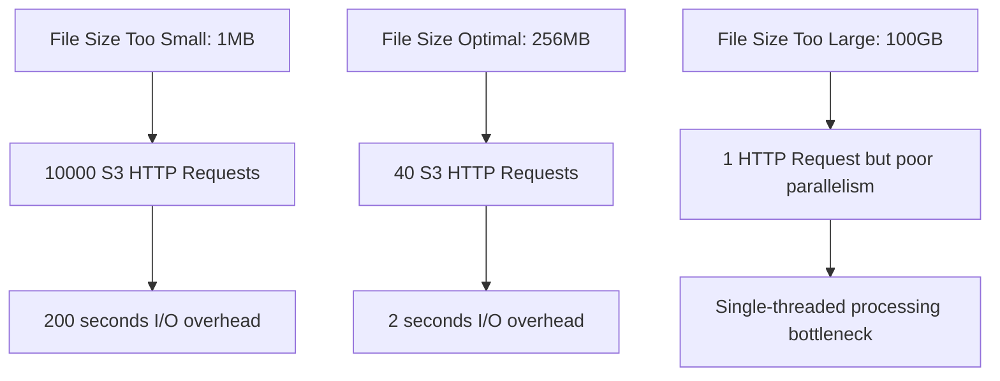
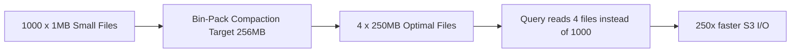

# Target File Size

## Core Definition

Target File Size is the configured desired size (in bytes) for data files written to or produced by a data lakehouse table format like Apache Iceberg. It is the primary parameter that governs the tradeoff between too many small files (causing the small file problem) and too few enormous files (limiting query parallelism and increasing waste when only a portion of the file is needed).

The target file size is the single most impactful tuning parameter for data lakehouse storage efficiency and query performance. Getting it right eliminates both the small file problem and the oversized file problem simultaneously.

## The Two-Sided Optimization Problem

**Too Small (Small File Problem):**
- S3 API overhead dominates I/O time: reading 10,000 × 10MB files requires 10,000 HTTP requests with 5-20ms each = 50-200 seconds of request overhead before any data is transferred.
- Thread scheduling inefficiency: assigning 1 million files to 100 workers requires 10,000 assignments per worker. The coordinator's scheduling overhead exceeds processing time for tiny files.
- Manifest file explosion: each file requires a metadata entry in Iceberg manifests. Millions of files create gigantic manifests that slow query planning.

**Too Large (Oversized File Problem):**
- Coarse parallelism: a 100GB file can only be processed by one thread (or one file reader) at a time. A cluster of 100 workers can't parallelize the processing of a single file efficiently.
- Wasted I/O for selective queries: if a query needs only 1% of the rows in a 100GB file, it still must read and decompress the entire file (or at least all matching Row Groups). A 500MB file that needs 1% reads 5MB; a 100GB file that needs 1% reads 1GB.
- Delayed writes: a streaming writer producing 100GB files must accumulate 100GB in memory before flushing — completely impractical for real-time ingestion pipelines.

## The Industry Standard Range

The standard recommended target file size for Apache Iceberg tables in 2025 is **256MB to 1GB uncompressed**, which typically corresponds to **64MB to 256MB on disk** after Snappy or Zstandard compression at typical compression ratios of 3:1 to 5:1.

The most common specific configurations:

- **128MB target on-disk (Parquet compressed):** ~512MB uncompressed. A conservative default balancing parallelism and overhead.
- **256MB target on-disk:** ~1GB uncompressed. Better for large batch analytics workloads where files are scanned fully.
- **512MB target on-disk:** ~2GB uncompressed. Suitable for very large tables where query-time parallelism is managed at the partition level rather than the file level.

Dremio's `OPTIMIZE TABLE` uses 256MB (262,144,000 bytes) as its default target and this is appropriate for most OLAP workloads over Iceberg tables.

## How Target File Size is Applied

**During Initial Writes:** Dremio's CTAS (Create Table As Select) and INSERT operations fill data files with rows until the current file reaches the target size, then close it and begin a new file. The writer monitors the current file's size in memory and flushes when the target is reached.

**During Compaction:** The `rewrite_data_files` procedure reads existing small files and combines their rows into new files targeting the configured size. The bin-packing strategy groups files into bins whose total size is approximately the target, producing output files close to the target size.

```sql
CALL catalog.system.rewrite_data_files(
  table => 'db.analytics_events',
  options => map(
    'target-file-size-bytes', '268435456',  -- 256MB
    'min-file-size-bytes', '134217728',     -- 128MB  
    'max-file-size-bytes', '536870912'      -- 512MB
  )
);
```

The `min-file-size-bytes` and `max-file-size-bytes` parameters define the acceptable range — files within this range are left unchanged, avoiding unnecessary rewriting of files that are already reasonably sized.

## Row Group Size Within Parquet Files

Even when files are optimally sized, the internal organization of Parquet files matters. Each Parquet file is divided into **Row Groups** with a target size of typically 128MB uncompressed (Apache Parquet default). Each Row Group has its own column statistics used for predicate pushdown within the file.

Smaller Row Groups provide finer-grained intra-file skipping at the cost of more Row Group metadata overhead. The default 128MB Row Group is appropriate for most workloads. Reducing Row Group size to 16-32MB benefits queries with very selective predicates on non-partitioned columns; increasing it to 256MB+ benefits queries that always scan the full file.

## Partition Size vs. File Size

Target file size interacts with table partitioning. For a date-partitioned Iceberg table:
- If each day's partition contains 10GB of data, a 256MB target produces ~40 files per partition.
- If each day's partition contains only 50MB of data (low-volume table), a 256MB target is impossible — each partition gets one file significantly smaller than the target.

For low-volume partitions that cannot fill a target-sized file, accept smaller files or use coarser partitioning (weekly instead of daily) to accumulate sufficient data per partition.

## Visual Architecture

### Diagram 1: File Size vs. Query Performance



### Diagram 2: Compaction Targeting Optimal Size


