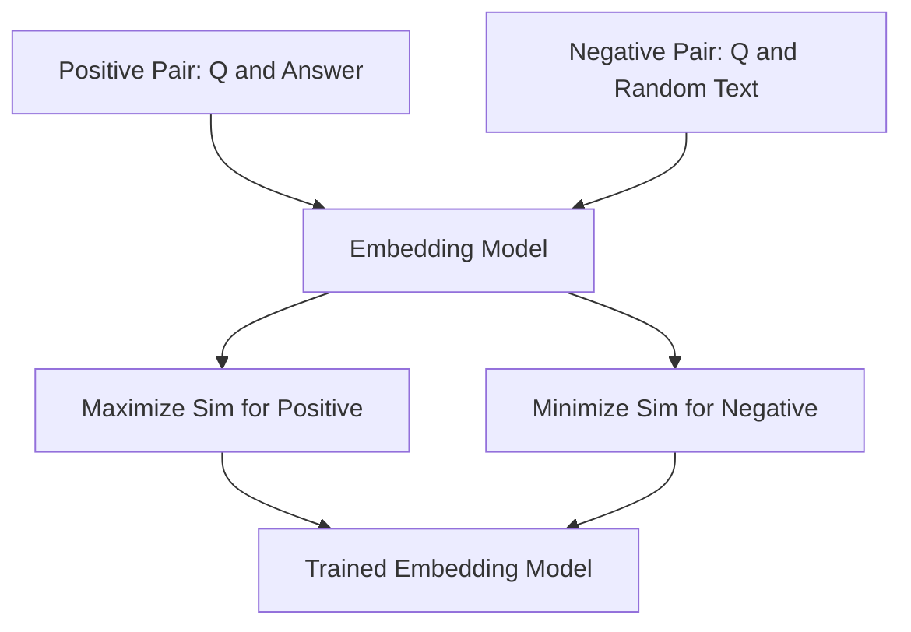

# Text Embeddings

## Core Definition

A text embedding is a numerical representation of a piece of text — a word, sentence, paragraph, or entire document — expressed as a dense vector of floating-point numbers. Embedding models are trained to encode semantic meaning into this vector representation such that text with similar meaning produces geometrically similar vectors, while text with different meaning produces vectors that are far apart in the vector space.

This concept is the mathematical foundation for all modern AI retrieval systems, including vector search, Retrieval-Augmented Generation (RAG), semantic clustering, recommendation engines, and duplicate detection. Without quality embeddings, none of these applications would work.

## From Words to Vectors: A Historical View

**Word2Vec (2013, Google):** The first widely used word embedding technique. Word2Vec trained a shallow neural network to predict either a word from its context (CBOW — Continuous Bag of Words) or the context from a word (Skip-gram). The resulting word vectors captured surprising semantic relationships: vector("king") - vector("man") + vector("woman") approximately equals vector("queen"). Word2Vec demonstrated that distributional semantics — the idea that words appearing in similar contexts have similar meanings — could be encoded into geometry.

**GloVe (2014, Stanford):** Global Vectors for Word Representation. GloVe trained word embeddings using global word co-occurrence statistics from the entire corpus rather than a sliding context window, producing more stable and consistent representations for rare words.

**ELMo (2018, AI2):** Embeddings from Language Models. Unlike Word2Vec and GloVe, which produce a single static vector per word regardless of context, ELMo uses a bidirectional LSTM to produce context-dependent word embeddings. The word "bank" produces a different ELMo vector in "river bank" vs "savings bank."

**BERT and Sentence Transformers (2018-2019):** BERT (Bidirectional Encoder Representations from Transformers) introduced the Transformer architecture for text encoding and produced deeply contextualized embeddings. However, BERT embeddings of full sentences are not directly suitable for similarity search — the [CLS] token representation was not trained for semantic similarity ranking. Sentence-BERT (SBERT, 2019) adapted BERT using siamese and triplet network fine-tuning with cosine similarity loss, producing sentence embeddings that directly encode semantic similarity. SBERT-based models remain the backbone of open-source embedding systems in 2025.

## How Modern Embedding Models Are Trained

Modern enterprise embedding models (OpenAI text-embedding-3-large, Cohere Embed v3, BGE-M3, E5-mistral) are trained using **contrastive learning** with large curated datasets of semantically similar and dissimilar text pairs.

**Positive pairs** are created from naturally occurring semantic relationships: a question and its answer from a Q&A dataset, a sentence and the document paragraph it was extracted from, two paraphrases of the same statement. **Negative pairs** are texts with unrelated meanings.

The training objective (InfoNCE loss) maximizes the cosine similarity between positive pair embeddings while minimizing it between negative pair embeddings. With millions of training examples, the model learns a continuous semantic geometry where proximity in vector space corresponds to shared meaning.

**Hard negative mining** — deliberately including difficult negatives that are superficially similar but semantically different ("The patient received treatment" vs "The treatment received the patient") — is critical for training high-precision embedding models.

## The Vector Space Geometry of Meaning

The resulting high-dimensional vector space has remarkable geometric properties.

**Semantic Clusters:** Embeddings of related concepts cluster together. All documents about Apache Iceberg, regardless of their specific wording, will form a cluster near each other in the embedding space.

**Analogical Reasoning:** Linear vector arithmetic encodes conceptual relationships. The semantic difference encoded in vector(Paris) - vector(France) approximately equals vector(Berlin) - vector(Germany) — both capture the "capital city of" relationship.

**Cross-Lingual Alignment:** Multilingual embedding models (like mBERT, XLM-RoBERTa, and LaBSE) map semantically equivalent sentences from different languages to nearby points in a shared vector space. "The cat sat on the mat" and "Le chat s'est assis sur le tapis" will have similar embeddings despite sharing no words.

**Isotropy Problem:** Embeddings in high-dimensional spaces tend to cluster in a narrow cone (low isotropy), leaving most of the vector space empty. This degenerate geometry reduces the effectiveness of cosine similarity as a distance measure. Techniques like whitening (normalizing the covariance structure of the embedding space) and contrastive fine-tuning can improve isotropy and downstream retrieval performance.

## Embedding Dimensions and Tradeoffs

Common embedding dimension counts and their practical implications:

**384 dimensions:** Lightweight, fast, low memory usage. Suitable for edge deployments and latency-critical applications where precision can be sacrificed. Models: all-MiniLM-L6-v2.

**768 dimensions:** The BERT standard. Good balance of quality and computational cost. Suitable for most enterprise RAG applications.

**1536 dimensions:** OpenAI's text-embedding-ada-002 and text-embedding-3-small use this dimension. High quality suitable for production enterprise RAG.

**3072 dimensions:** OpenAI's text-embedding-3-large and BGE-M3. Highest precision for complex analytical and technical retrieval tasks. Higher memory and compute cost.

## Late Interaction Models: ColBERT

Standard embedding models produce a single vector per document (bi-encoder architecture). ColBERT (Contextualized Late Interaction over BERT) produces one vector per token and computes query-document similarity as the sum of maximum similarity scores between each query token vector and all document token vectors (MaxSim operation).

ColBERT provides significantly higher retrieval precision than bi-encoders for complex queries because it preserves fine-grained token-level semantic information. The tradeoff is larger storage (one vector per token vs. one vector per document) and slightly higher query latency. ColBERT-based re-ranking (ColBERT-v2, used in RAGatouille) is a popular way to improve precision in a two-stage retrieval pipeline: coarse retrieval with a bi-encoder, precise re-ranking with ColBERT.

## Embedding Models for Structured Data

Standard text embedding models are trained on natural language text. Embedding structured data (table rows, SQL queries, schema definitions) requires specialized training.

**Schema embedding:** Embedding table and column names alongside their descriptions allows agents to semantically discover relevant tables in a large data catalog. An agent querying "customer purchase history" can find the `fact_transactions` table even though the name does not contain those words.

**SQL embedding:** Models fine-tuned on pairs of natural language questions and their SQL translations (NL-SQL pairs) can be used to retrieve similar past queries from a query library, enabling few-shot Text-to-SQL by providing the LLM with relevant examples.

## Enterprise Deployment Considerations

**Model hosting:** Embedding models can be called via API (OpenAI, Cohere) or self-hosted using inference frameworks like Hugging Face Text Embeddings Inference (TEI) or vLLM. Self-hosting eliminates data privacy concerns but adds operational overhead.

**Batching:** Embedding large document corpora efficiently requires batching multiple texts into a single model call. Most embedding servers support batch sizes of 32-512 texts per request.

**Caching:** If the same query text is submitted multiple times (common in a shared analytics system), caching the embedding vectors eliminates redundant model inference. Redis or a local in-memory cache typically suffices.

**Corpus re-embedding:** Changing the embedding model requires re-embedding the entire document corpus. Organizations should treat the embedding model as a versioned infrastructure component and plan for periodic re-embedding cycles as better models become available.

## Visual Architecture

### Diagram 1: Embedding Training (Contrastive Learning)

### Diagram 2: Embedding at Query Time

