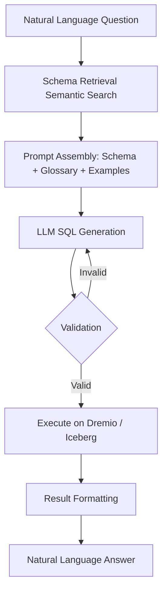
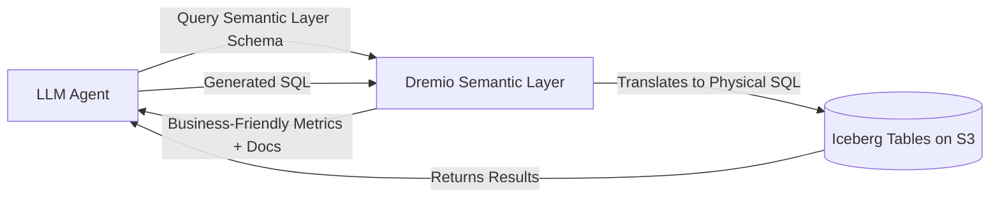

# Text-to-SQL

## Core Definition

Text-to-SQL is the task of automatically translating a natural language question or instruction into a valid SQL query that, when executed against the target database, returns the data needed to answer the question. It is one of the most commercially impactful AI applications in the enterprise data ecosystem, because it enables business users with no SQL knowledge to directly query structured data in data warehouses and data lakehouses.

A Text-to-SQL system takes input such as "Show me the total revenue for each product category in APAC for Q3 2025, sorted from highest to lowest" and generates an executable SQL query like:

```sql
SELECT p.category, SUM(f.net_revenue) AS total_revenue
FROM fact_sales f
JOIN dim_product p ON f.product_id = p.product_id
JOIN dim_geography g ON f.geo_id = g.geo_id
JOIN dim_date d ON f.date_id = d.date_id
WHERE g.region = 'APAC'
  AND d.fiscal_quarter = 'Q3'
  AND d.fiscal_year = 2025
GROUP BY p.category
ORDER BY total_revenue DESC;
```

This query can then be executed against Apache Iceberg tables via Dremio, Trino, or Spark SQL, and the result returned to the user in natural language form.

## Historical Development

Early Text-to-SQL systems used rule-based parsing, semantic parsing grammars, and template-based approaches. These systems required extensive manual engineering for each new database schema and could only handle narrow, predefined query patterns.

The deep learning era brought seq2seq models (attention-based encoder-decoder architectures) that could learn query generation from NL-SQL training pairs. The Spider benchmark (2018, Yale University) became the standard benchmark for Text-to-SQL evaluation: a dataset of 10,000+ natural language questions over 200 databases from 138 different domains.

The LLM era has transformed Text-to-SQL. Large language models trained on massive code corpora have internalized SQL syntax and semantics from millions of training examples. By providing an LLM with the database schema in the prompt, modern systems achieve human-expert-level SQL generation accuracy on complex queries without any fine-tuning: using only in-context learning.

## The Modern LLM Text-to-SQL Pipeline

**Step 1, Schema Retrieval:** The system determines which tables and columns are relevant to the user's question. For small schemas (fewer than 50 tables), the entire schema DDL is included in the prompt. For large enterprise schemas with thousands of tables, semantic search over embedded schema descriptions retrieves only the relevant subset.

**Step 2, Prompt Construction:** The LLM prompt is assembled with:
- A system message establishing the SQL generation role and output format
- The relevant table DDL (CREATE TABLE statements with column names, data types, descriptions)
- Business glossary entries (metric definitions, business term to column name mappings)
- Few-shot examples of NL/SQL pairs demonstrating the organization's query patterns
- The user's natural language question

**Step 3, SQL Generation:** The LLM generates a SQL query. Modern frontier models (GPT-4o, Claude 3.5 Sonnet, Gemini 1.5 Pro) achieve over 90% execution accuracy on the Spider benchmark with well-designed prompts.

**Step 4, Validation:** The generated SQL is validated syntactically (parsed to check for syntax errors) before execution. Many systems use a "self-repair" loop: if the SQL fails validation or execution, the error message is fed back to the LLM as additional context, and the model generates a corrected query.

**Step 5, Execution and Result Formatting:** The validated SQL is executed against the data lakehouse. The result set is returned to the LLM (or a separate formatting agent), which presents the data in natural language with appropriate context ("Q3 2025 APAC revenue was $4.2 billion, with Electronics being the top category at $1.8 billion: up 12% from Q3 2024").

## Schema Linking

The core technical challenge in Text-to-SQL is **schema linking**: correctly mapping words in the natural language question to the appropriate tables and columns in the database schema. "revenue" must be linked to `fact_sales.net_revenue`; "product category" must be linked to `dim_product.category`; "last quarter" must be resolved to a specific fiscal quarter value in `dim_date`.

Modern approaches to schema linking:

**Exact string matching:** Words in the question that exactly match table or column names receive high confidence scores for that mapping.

**Embedding similarity:** Question phrase embeddings are compared against column description embeddings to find the most likely mapping for non-obvious vocabulary differences.

**Business glossary lookup:** A structured glossary (maintained by data engineers) maps business terms to specific columns: "revenue" → `fact_sales.net_revenue`, "APAC" → `dim_geography.region = 'APAC'`.

**Few-shot demonstration:** Including example NL/SQL pairs that demonstrate the correct mapping of key terms in the prompt allows the LLM to infer the correct mappings for similar terms in novel questions.

## Evaluation Metrics

**Execution Accuracy (EX):** The fraction of generated queries that, when executed, return the same result as the gold (human-written) SQL query. This is the most meaningful metric for real-world use.

**Exact Set Match (EM):** The fraction of generated queries that exactly match the structure of the gold SQL query. Less useful in practice because multiple syntactically different queries can return identical results.

**Valid Efficiency Score (VES):** Combines execution accuracy with query efficiency, rewarding systems that generate not just correct queries but queries that execute efficiently (use indexes, avoid unnecessary full table scans).

## Text-to-SQL with Semantic Layers

A critical advancement for enterprise Text-to-SQL is integration with semantic layers. Rather than exposing raw database tables directly to the LLM, the semantic layer (implemented in Dremio, dbt, or Apache Superset) presents pre-defined, business-friendly virtual datasets with:

- Human-readable names (not cryptic internal table names)
- Pre-computed metric definitions (revenue, customer lifetime value, churn rate) expressed as SQL expressions
- Pre-joined views that eliminate the need for the LLM to know complex join paths
- Column-level business documentation embedded directly in the schema

With a rich semantic layer, the LLM receives clear, unambiguous column descriptions and metric definitions, dramatically improving SQL accuracy and reducing the need for schema linking disambiguation.

Dremio's semantic layer is particularly well-suited for Text-to-SQL because it exposes virtual datasets over Iceberg tables with full column documentation, metric definitions, and row-level security: enabling the AI agent to generate accurate, governed SQL that automatically respects access control policies.

## Visual Architecture

### Diagram 1: Text-to-SQL Pipeline



### Diagram 2: Semantic Layer in Text-to-SQL


