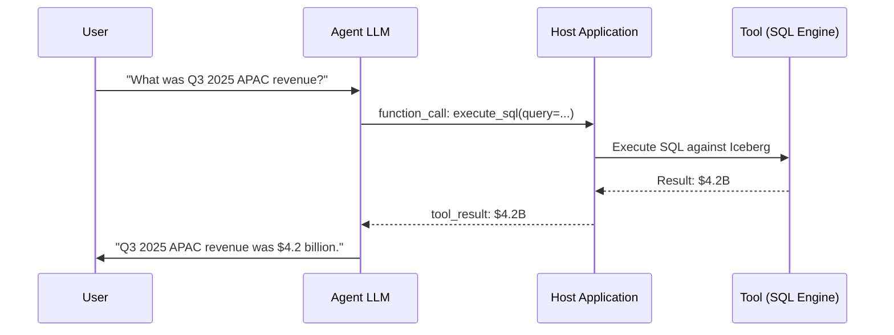
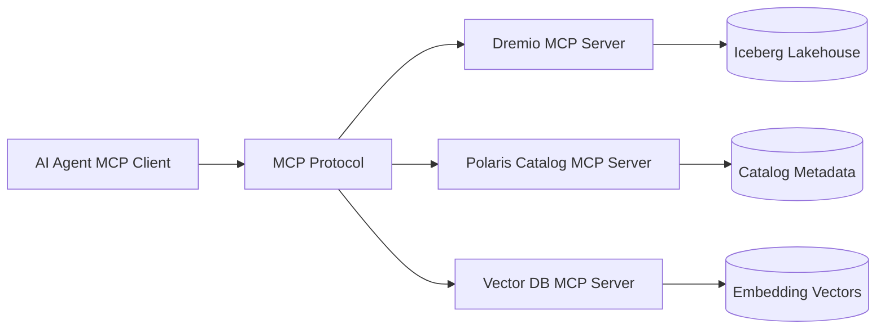

# Tool Use (Function Calling)

## Core Definition

Tool Use, also called Function Calling, is the capability of modern Large Language Models to generate structured requests to execute predefined external functions — databases, APIs, code interpreters, file systems, and any other programmable interface — and incorporate the results into their ongoing reasoning process.

This capability transforms an LLM from a static text generator into a dynamic agent capable of interacting with the world. An LLM without tool use can only reason about information already present in its training data or context window. An LLM with tool use can query a live database for today's inventory numbers, execute code to calculate statistical confidence intervals, search a vector database for relevant documentation, or trigger a data pipeline run — all autonomously within a reasoning loop.

Tool use is the mechanism that makes AI agents practical in enterprise data lakehouse environments. Without it, an LLM asked "What was our Q3 2025 APAC revenue broken down by product category?" can only hallucinate an answer. With a SQL tool connected to Dremio over an Iceberg lakehouse, it can formulate and execute the exact query and return a precise, verifiable answer.

## How Function Calling Works

**Step 1 — Tool Registration:** Before inference, the application developer provides the LLM with a JSON schema describing all available tools. Each tool definition includes a name, a natural language description (what the tool does), and a parameters schema (what arguments it accepts, their data types, and which are required). The LLM reads these tool definitions as part of its context.

**Step 2 — LLM Decision:** During its reasoning loop, the LLM determines that to make progress toward the user's goal, it needs to call an external tool. Rather than generating natural language text, it generates a structured JSON object specifying the tool name and the arguments to pass to it.

**Step 3 — Tool Execution:** The host application (the agent framework: LangChain, LlamaIndex, AutoGen, CrewAI, or a custom implementation) intercepts the function call JSON, validates the arguments against the schema, and executes the actual function. This execution happens entirely in the host application's code — the LLM never directly touches external systems. The LLM's role is only to specify what to call and with what arguments.

**Step 4 — Result Injection:** The tool's output (a SQL query result set, an API response, code execution stdout, a file's contents) is formatted as a "tool result" message and injected back into the conversation context as the next observation.

**Step 5 — Continued Reasoning:** The LLM reads the tool result and continues its reasoning process. It may determine the goal is achieved and synthesize a final answer, or it may decide another tool call is needed.

## JSON Schema Tool Definition

A concrete example of a tool definition for a SQL execution tool:

```json
{
  "name": "execute_sql",
  "description": "Execute a SQL SELECT query against the enterprise data lakehouse and return the results as a JSON array of rows. Use this tool when you need precise numerical data from structured datasets.",
  "parameters": {
    "type": "object",
    "properties": {
      "query": {
        "type": "string",
        "description": "A valid SQL SELECT statement. Do not include semicolons."
      },
      "database": {
        "type": "string",
        "description": "The target database/catalog to query. Options: 'finance', 'sales', 'operations'."
      }
    },
    "required": ["query", "database"]
  }
}
```

## Parallel Tool Calling

Modern LLM APIs (OpenAI, Anthropic, Google Gemini) support generating multiple tool calls in a single model response. When the agent determines that several independent pieces of information are needed simultaneously, it can issue all tool calls in one output rather than sequentially. The host application executes them in parallel and returns all results together, dramatically reducing the total latency of multi-step workflows.

For example, when asked to compare Q3 2025 performance across three regions, the agent might simultaneously issue SQL queries for North America, APAC, and EMEA revenue data, receive all three results in parallel, and then synthesize the comparison — completing in the time of one query round-trip rather than three.

## Model Context Protocol (MCP)

The Model Context Protocol (MCP), released by Anthropic in November 2024 and rapidly adopted across the industry, is an open standard that defines a universal interface between AI agents and external data sources and tools. MCP separates the tool implementation (an MCP Server, which exposes specific tools and resources via a standard protocol) from the tool consumer (the MCP Client, embedded in the agent framework or IDE).

This separation means a Dremio MCP Server that exposes SQL execution and catalog browsing tools works with any MCP-compatible agent — Claude, GPT-4, Llama 3 — without requiring custom integration code for each combination. MCP dramatically reduces the integration burden of building tool-augmented AI agents and has become the de facto standard for enterprise AI tool connectivity.

## Tool Design Principles

The quality of tool definitions directly impacts the accuracy and reliability of AI agents. Poorly designed tools lead to incorrect function calls, argument validation failures, and agent confusion.

**Specificity:** Tool descriptions should be precise about what the tool does, what it returns, and when it should (and should not) be used. Ambiguous descriptions lead to inappropriate tool selection.

**Idempotency:** Tools called within an agent's reasoning loop may be called multiple times if the agent loops. Tools that have side effects (inserting records, sending emails, triggering pipeline runs) must be designed to be safe to re-call or must include explicit confirmation gates.

**Error Handling:** Tools must return structured error messages when they fail (invalid SQL, API timeout, access denied) that the LLM can read and use to recover gracefully — typically by reformulating the failing call with corrected arguments.

**Granularity:** Prefer many small, focused tools over a few large, multi-purpose tools. An agent that can separately call `get_table_schema`, `execute_sql`, and `get_query_history` has finer-grained control than one with a single `database_operations` tool.

## Tool Use in the Data Lakehouse

In an open data lakehouse environment, the core tool set for an analytics agent includes:

**Catalog Discovery:** Query Apache Polaris or AWS Glue to list available tables, retrieve table schemas, read column descriptions, and explore data lineage.

**SQL Execution:** Execute analytical SQL against Dremio, Trino, or Spark SQL over Apache Iceberg tables. Return results as structured data for the agent to reason over.

**Data Profiling:** Retrieve statistical profiles (min, max, mean, null count, distinct count) for specific columns to help the agent understand the data distribution before formulating complex queries.

**Vector Search:** Query a vector database to retrieve relevant documentation, past analyses, or catalog entries for the current analytical context.

**Visualization:** Generate charts from query result data using Matplotlib, Plotly, or a REST API to a visualization service.

**Pipeline Trigger:** Trigger a data pipeline run via Airflow API or Dagster GraphQL API when the agent determines that a required dataset is stale and needs refreshing.

## Visual Architecture

### Diagram 1: Function Calling Flow



### Diagram 2: MCP Architecture


