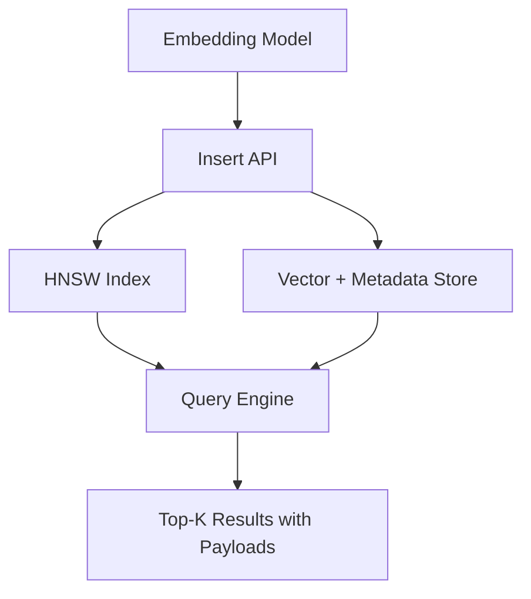
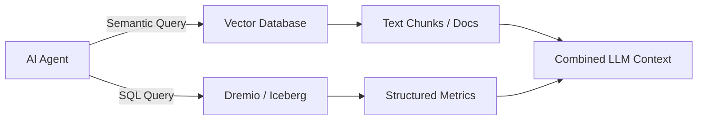

# Vector Databases

## Core Definition

A Vector Database is a specialized database management system engineered to store, index, and efficiently query high-dimensional vector embeddings at scale. Vector databases are the dedicated persistence and retrieval infrastructure for AI applications requiring semantic search: Retrieval-Augmented Generation (RAG) systems, recommendation engines, image and audio similarity search, anomaly detection, and AI agent long-term memory stores.

Traditional relational databases are optimized for exact lookups on structured fields. Full-text search engines are optimized for keyword matching via inverted indexes. Vector databases occupy a different design space: they are optimized for Approximate Nearest Neighbor (ANN) search across collections of millions or billions of floating-point vectors, each with hundreds or thousands of dimensions.

## Core Architectural Components

**Vector Storage Layer:** Stores each vector (the embedding), its associated metadata (source document, creation date, category, author, department), and its payload (the raw text chunk used to populate an LLM's context). Modern vector databases like Weaviate and Qdrant store all three components in a single integrated system, eliminating the need for a separate metadata database and the synchronization complexity that would entail.

**ANN Index:** The computational engine of the vector database. Most production systems use HNSW (Hierarchical Navigable Small World) as the primary index due to its superior recall-latency tradeoff. The HNSW index is a multi-layer graph structure built incrementally as vectors are inserted. It enables sub-10ms approximate nearest neighbor queries over tens of millions of vectors.

**Filtering Engine:** Raw ANN search sweeps the entire vector collection. Enterprise applications require combining semantic similarity with structured metadata filters: "Find the 10 most semantically similar compliance reports, but only from the Legal department, filed after 2024-06-01, with status = approved." Vector databases implement sophisticated filtering strategies to support this without degrading recall or latency.

**Query Planner:** Determines the optimal execution strategy for each query: whether to pre-filter, post-filter, or apply in-index filtering during HNSW graph traversal, based on the estimated selectivity of the filter predicates.

**Persistence and Replication:** Production vector databases write indexes to disk using write-ahead logs (WAL) and support replication across nodes for high availability. Some systems (Milvus, Weaviate) support distributed cluster deployments for billion-scale collections.

## Major Vector Database Platforms

**Pinecone:** A fully managed, cloud-native vector database built specifically for production AI applications. Pinecone handles all infrastructure management, automatic scaling, and replication. It provides a simple API and the lowest operational overhead, making it the fastest path to production. The tradeoff is higher cost at scale and full vendor dependency.

**Weaviate:** An open-source vector database with strong multi-modality support (text, images, video, audio can all be embedded and stored together), a graph-like object model that expresses relationships between stored objects, and support for running embedding models directly inside the database via "vectorizer" modules. Weaviate supports hybrid search (vector + BM25) natively and can be self-hosted or used as a managed cloud service.

**Qdrant:** An open-source, high-performance vector database implemented in Rust for memory efficiency and CPU performance. Qdrant uses a modified HNSW implementation that supports payload-based filtering applied during graph traversal, achieving high recall even with highly selective metadata filters. It provides excellent single-node performance and a clean REST and gRPC API.

**Milvus:** A highly scalable distributed open-source vector database designed for billion-scale deployments. Milvus uses a disaggregated storage-compute architecture (separating query nodes, index nodes, data nodes, and coordinators) that enables independent horizontal scaling of each component. It supports multiple index types (HNSW, IVF_FLAT, IVF_PQ, DiskANN for on-disk indexing of datasets that exceed RAM).

**pgvector:** A PostgreSQL extension that adds a `vector` data type and ANN index support directly to PostgreSQL. For organizations already running PostgreSQL, pgvector eliminates the operational overhead of a separate vector database system. It supports both HNSW and IVF indexes. Performance at very large scale (tens of millions of vectors) is lower than dedicated vector databases, but for moderate-scale applications it is an excellent operationally efficient choice.

**Chroma:** A lightweight embedded vector store designed for local development and rapid prototyping. Chroma runs in-process alongside the Python application, requires no separate server, and persists to disk. It is widely used in LangChain and LlamaIndex tutorials and proof-of-concept applications.

## Indexing Strategies

**HNSW (Hierarchical Navigable Small World):** Multi-layer graph index. Excellent recall (95-99%) at low latency (1-10ms) for dynamic workloads with frequent inserts. Higher memory usage than IVF.

**IVF (Inverted File Index):** Clusters vectors using k-means, searches only closest clusters at query time. Lower memory during search, excellent throughput for static datasets. Requires training phase. Lower recall at low nprobe values.

**DiskANN:** Graph-based index designed to operate primarily on SSD storage rather than RAM, enabling billion-scale indexing on commodity hardware without requiring massive RAM. Slightly higher latency than in-memory HNSW but dramatically lower infrastructure cost for very large datasets.

**ScaNN (Scalable Nearest Neighbors, Google):** Uses learned quantization and anisotropic vector quantization to achieve very high throughput at modest recall levels. Excellent for recommendation systems where recall can be tuned against throughput.

## Vector Quantization

Storing billions of 1536-dimensional float32 vectors requires enormous RAM (approximately 6TB for one billion vectors). Vector quantization compresses vectors into lower-precision representations at the cost of a small, measurable reduction in recall accuracy.

**Scalar Quantization (SQ):** Reduces each float32 value (4 bytes) to an int8 value (1 byte), achieving 4x compression. Recall loss is typically less than 2%.

**Product Quantization (PQ):** Splits the vector into subvectors and independently quantizes each subvector using a learned codebook. Achieves 16-32x compression at the cost of 5-10% recall reduction. The dominant compression technique for very large-scale deployments.

## Operational Considerations in the Enterprise

**Embedding Model Consistency:** The same embedding model must be used for both indexing and querying. Changing embedding models requires re-embedding the entire corpus — a significant operational event.

**Index Rebuild:** As the vector collection grows, the HNSW index may become suboptimally structured. Periodic index optimization (compaction) improves query performance. Most production vector databases handle this transparently in the background.

**Multi-tenancy:** Enterprise deployments serving multiple business units require namespace isolation, separate access control, and optionally separate physical indexes per tenant to prevent cross-contamination of retrieval results.

**Lakehouse Integration:** Some organizations store raw embeddings directly in Apache Iceberg tables alongside other structured data. This enables unified governance (catalog management, lineage tracking, access control) over both embedding vectors and structured metrics, leveraging the lakehouse as the single source of truth.

## Visual Architecture

### Diagram 1: Vector Database Architecture

### Diagram 2: Multi-Modal Enterprise Retrieval

