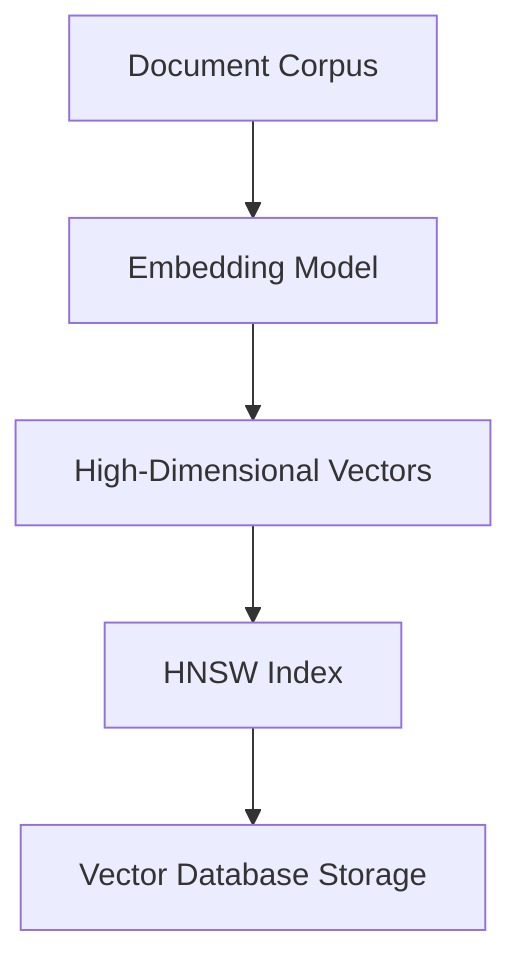
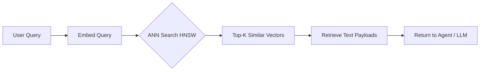

# Vector Search

## Core Definition

Vector Search (also called semantic search or similarity search) is a retrieval technique that finds results based on the conceptual meaning and semantic similarity of a query rather than exact keyword matches. Where traditional keyword search finds documents that contain the literal words in the query, vector search finds documents whose meaning is closest to the query's meaning — even when the documents share no common words with the query.

The mechanism is deceptively simple in concept: represent both queries and documents as points in a high-dimensional numerical space (vectors), and retrieve the points geometrically closest to the query point. Two pieces of text with similar meanings will have vectors that are close together in this space, enabling meaning-based retrieval at scale.

## The Vector Representation Problem

Before vector search can operate, text must be converted into numerical vectors. This is the role of embedding models. An embedding model is a neural network (typically transformer-based) trained via contrastive learning to map semantically similar texts to nearby points in the vector space and push semantically dissimilar texts apart.

The training signal comes from pairs of sentences labeled as "similar" or "dissimilar" by human annotators, or from natural semantic relationships in text (e.g., a question and its Wikipedia answer are treated as a similar pair during training). After training, the model has learned a continuous high-dimensional semantic space where meaning determines geometry.

Common embedding dimensions are 384, 768, 1024, 1536, and 3072. Higher dimensions generally capture richer semantic distinctions at the cost of more memory and computation.

## Cosine Similarity

The most widely used similarity metric for text vectors is cosine similarity, which measures the cosine of the angle between two vectors. A score of 1.0 means the vectors point in exactly the same direction — maximum semantic similarity. A score of 0.0 means the vectors are orthogonal — no detectable semantic relationship. A score close to -1.0 means the vectors point in opposite directions — semantic opposition.

Cosine similarity focuses on the direction of vectors rather than their magnitude. This is critical for text because a long document about "machine learning" and a short sentence about "machine learning" should have similar semantic vectors even though the long document naturally has larger raw magnitude due to more information content.

## Approximate Nearest Neighbor Search

Finding the exact nearest neighbor to a query vector in a collection of millions of vectors requires computing the distance between the query and every single stored vector — an O(n) operation that becomes prohibitively slow at scale. Even with GPU acceleration, exact search over 100 million vectors takes several seconds, far too slow for interactive applications.

Approximate Nearest Neighbor (ANN) algorithms solve this by using pre-built index structures that dramatically prune the search space, returning results that are very likely the true nearest neighbors (with measurable recall accuracy) in milliseconds. The tradeoff is a small probability of missing the single absolute nearest neighbor, which in practice is an acceptable cost for massive speed gains.

## HNSW: The Dominant ANN Index

Hierarchical Navigable Small World (HNSW) is the most widely deployed ANN algorithm in production vector search systems. HNSW builds a multi-layer graph where each node represents a stored vector.

The top layer contains a sparse long-range graph connecting distant nodes, enabling rapid coarse navigation. Lower layers progressively densify the connections, enabling precise local refinement. During insertion, a node is assigned a maximum layer level drawn from an exponentially decaying probability distribution, and bidirectional connections are established at each layer up to that level.

During search, the algorithm enters at a random node in the top layer and greedily navigates toward the query vector by always moving to the connected neighbor with the smallest distance to the query. After converging in the top layer, it descends to the next layer and repeats, progressively refining the candidate set until it converges in the bottom layer with a set of high-quality approximate nearest neighbors.

HNSW typically achieves recall rates above 95% at query latencies of 1-10 milliseconds for collections of tens of millions of vectors, making it the standard choice for production AI retrieval systems.

## IVF: Inverted File Index

The Inverted File (IVF) approach first clusters the vector space into Voronoi cells using k-means. The cluster centroids are stored in a flat index. During search, the algorithm finds the closest centroids to the query (typically 10-100 cells) and exhaustively searches only the vectors within those cells.

IVF provides excellent throughput for very large static datasets and requires less memory than HNSW during search, but it requires an expensive training phase to compute the k-means clustering and is less accurate than HNSW when the number of probed cells is small.

## Hybrid Search

Pure vector search excels at semantic understanding but fails on exact term matching. If a user searches for product code "SKU-12345-XL-RED," a semantic vector search might return semantically similar product descriptions instead of the exact match. Conversely, pure keyword search (BM25) excels at exact matching but cannot understand that "revenue shortfall" and "earnings miss" are semantically equivalent.

Hybrid search combines both modalities. Dense vector search handles semantic similarity; sparse keyword search (BM25 or SPLADE) handles exact term matching. The scores from both searches are combined using Reciprocal Rank Fusion (RRF) — a score-agnostic fusion method that combines ranks rather than raw scores, making it robust to score distribution differences between the two retrieval modalities.

Modern vector databases (Weaviate, Qdrant, Milvus) implement hybrid search natively, executing both retrieval modes in parallel and returning a fused, ranked result set.

## Metadata Filtering

In enterprise applications, raw similarity search across all vectors is rarely sufficient. Users want semantic search within a constrained subset: "Find similar documents but only from the Finance department, created after 2025-01-01, marked as approved."

Metadata filtering applies structured predicates to the stored metadata (department, date, status, author) either before, during, or after the ANN search. Pre-filtering restricts the search space first but can cause the HNSW graph to become disconnected in sparse filtered subsets. Post-filtering runs the full ANN search and then discards non-matching results, risking an insufficient number of results if the filter is very selective.

The most effective approach, implemented by Qdrant's "filterable HNSW," applies filtering during graph traversal by skipping filtered-out nodes, maintaining high recall without the pitfalls of pre- or post-filtering strategies.

## Vector Search in the Lakehouse

Vector search complements SQL-based retrieval in the open data lakehouse. SQL excels at precise quantitative queries against structured Iceberg tables ("Total revenue by region for Q3 2025"). Vector search excels at semantic retrieval over unstructured text assets: analytical commentary, executive memos, schema documentation, and historical reports stored in the knowledge base.

AI agents use both modalities: SQL tool calls for numbers, vector search tool calls for context. The combination enables comprehensive analytical answers that include both precise quantitative data and rich qualitative narrative.

## Visual Architecture

### Diagram 1: Vector Search Index Flow

### Diagram 2: Query-Time Retrieval

