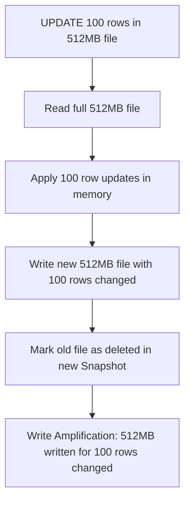
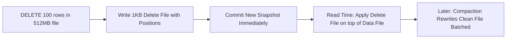

# Write Amplification

## Core Definition

Write Amplification is a phenomenon in data storage and processing systems where the actual amount of data written to storage is significantly larger than the logical amount of data being modified. In the context of an open data lakehouse, write amplification most commonly occurs with Copy-on-Write (CoW) table semantics, where updating or deleting even a small number of rows requires rewriting entire data files containing those rows.

Write amplification is measured as the ratio of bytes physically written to bytes logically modified. A write amplification factor of 100 means that updating 1MB of data requires writing 100MB to storage — the updated records plus 99MB of unchanged records from the same files that must be rewritten to produce new file versions.

## The Copy-on-Write Root Cause

Apache Iceberg with Copy-on-Write semantics (the default for UPDATE and DELETE operations) never modifies existing Parquet files in place. Parquet files are immutable once written — this immutability is fundamental to Iceberg's ACID semantics and its ability to support snapshot isolation for concurrent readers.

When a row must be updated or deleted, Iceberg must:
1. Identify all data files containing rows that match the update/delete predicate.
2. Read each of those files completely into memory.
3. Apply the update/delete to the matching rows.
4. Write new data files containing the updated (or non-deleted) rows.
5. Register the new files in a new Iceberg snapshot, marking the old files as deleted.

If a 512MB data file contains 1,000,000 rows and only 100 of those rows need to be updated, the entire 512MB file must be rewritten to produce a new 512MB file with 100 rows modified. The write amplification factor is 512MB written / 100 rows × ~512 bytes per row ≈ 5,120 / 1 = 5120x amplification.

## Scenarios Where Write Amplification is Severe

**Low-selectivity UPDATE/DELETE:** `UPDATE fact_sales SET price = price * 1.1 WHERE product_id = 'SKU-12345'` updates rows scattered across hundreds or thousands of data files. Each touched file must be fully rewritten, regardless of how few rows within it were modified.

**CDC (Change Data Capture) MERGE/UPSERT Workloads:** Real-time CDC pipelines continuously receive updated records that must be merged into the existing lakehouse tables. If each daily batch updates 0.1% of rows spread across the entire table, the entire table must be rewritten each day — 1000x write amplification.

**Time-Series Updates:** Historical corrections to time-series data (correcting erroneous sensor readings from 3 months ago) touch files scattered across old partitions, each requiring full rewrite.

## Merge-on-Read: Reducing Write Amplification

Apache Iceberg's Merge-on-Read (MoR) write mode directly addresses write amplification by decoupling the write operation from the rewrite operation:

**Instead of rewriting data files immediately**, MoR writes lightweight delete files that record which rows are deleted (by file position for position deletes, or by key value for equality deletes). The delete files are tiny — a position delete file for 100 deleted rows in a 512MB data file might be only 1KB. Write amplification factor: 1KB / 100 rows = effectively 1x.

**The cost is paid at read time**: readers must apply delete files on top of data files during query execution, increasing read complexity and CPU cost. For workloads with many more reads than writes (typical analytical workloads), MoR's superior write performance is worth the read overhead.

**Compaction resolves accumulated deletes**: Periodic compaction rewrites files, merging delete files into updated data files and restoring full read performance. The compaction operation itself writes amplified data, but this is a controlled, batched operation rather than inline with every CDC event.

## Write Amplification in Compaction

Paradoxically, compaction — which is run to fix the small file problem — itself causes write amplification. Compaction reads existing data files and rewrites their contents into new, larger files. If a 500GB partition is compacted, 500GB is read and 500GB is written (or slightly less if deleted rows are merged out). The net write amplification of compaction is 1x (identical data rewritten once), but in absolute terms it is a large write operation.

Organizations must balance the write amplification cost of compaction against the query performance benefits. In cost terms: compaction costs compute time to rewrite data + S3 PUT costs for new files + S3 DELETE costs for old files. For large tables, this can be significant.

## Quantifying Write Amplification

Write amplification in an Iceberg table can be estimated by comparing:
- Bytes written to S3 (from AWS Cost Explorer / CloudTrail S3 put event sizes)
- Net bytes of logical data change (rows updated × avg row size)

Monitoring this ratio over time allows data engineers to identify operations with excessive write amplification and optimize their write strategy accordingly.

## Visual Architecture

### Diagram 1: Copy-on-Write Amplification

### Diagram 2: Merge-on-Read Reduces Write Amplification

